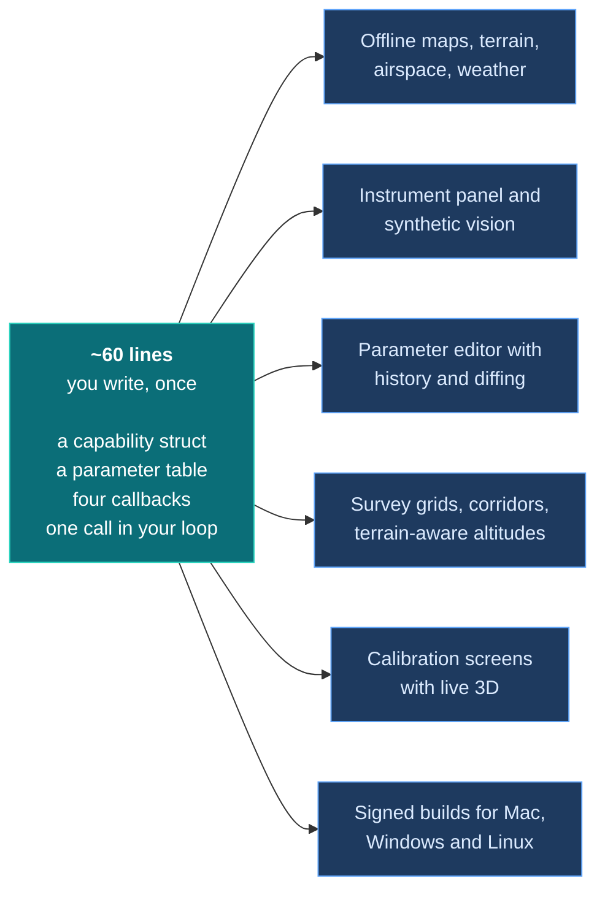

# ArduDeck Vehicle SDK

**Two C files that give your flight controller a real ground station.**

Map, instrument panel, parameter editor, mission planner, calibration screens. You declare
what your vehicle is and wire four callbacks. The protocol is not your problem.

```c
#include "ardudeck.h"

static const ad_capability_t CAPS = {
  .vendor = "acme", .model = "quad v2", .firmware = "1.4.0",
  .frame = AD_FRAME_MULTIROTOR,
};

static void sink(const uint8_t *b, size_t n, void *u) { link_write(b, n); }

void setup(void) {
  ardudeck_begin(&(ad_config_t){ .caps = &CAPS, .send = sink, .now_ms = millis });
}

void loop(void) {
  ardudeck_position(lat, lon, speed_ms, heading_deg, fix, sats);
  ardudeck_attitude(roll_rad, pitch_rad, yaw_rad);
  ardudeck_status(mode_id, 0, battery_v, armed);
  ardudeck_tick(millis());
}
```

That is a vehicle on the map with a live instrument panel. Not an excerpt: eighteen lines.

### ➜ **[Start here: Getting started](docs/getting-started.md)** ·  about twenty minutes

---

## Why this exists

Writing a ground station is the expensive half of building a flight controller, and
almost nobody wants to.



None of those sixty lines is new behaviour. It is a second encoding of state your firmware
already keeps.

---

## One rung at a time

Each rung is independent and shippable on its own. Stop wherever it stops being worth it.

| Rung | You add | You get |
|:---:|---|---|
| **0** | Heartbeat, position, attitude | Map, instrument panel, HUD, fleet row |
| **1** | One capability struct | Your modes by name. Screens you cannot serve are hidden rather than broken |
| **2** | One parameter table | The whole editor, with your units, ranges and descriptions |
| **3** | One mission callback | Mission planning, survey grids, upload and download |
| **4** | One command callback | Arm, mode change, start, pause, return |
| ✦ | A calibration description | Calibration screens drawn from your own routine |

> ### The rule everything runs on
>
> **A capability you do not declare is a screen ArduDeck hides.**
>
> Declare less than you support and you lose a screen until you add it. Declare more and
> your operator gets a planner that uploads missions you refuse, and buttons that do
> nothing. **Under-declare, then grow.**

---

## Prove it before you ship

`ardudeck-conform` pretends to be a ground station and tells you whether your vehicle does
what it claims. "Supports MAVLink" is a sentence; this is a table.

```
$ ardudeck-conform --serial /dev/ttyUSB0:57600

acme quad v2  fw 1.4.0  profile 1

PASS  rung 0  position      heartbeat 1.0 Hz, 40 position, 43 attitude, fix 3
PASS  rung 1  identity      4 modes named, 2 mission commands
FAIL  rung 2  parameters    5 parameters, 5 with metadata
                            -> 3 parameters have no description -> PITCH_KP, PITCH_KI
PASS  rung 3  missions      3 items round-tripped, capacity 16
PASS  rung 4  commands      unknown command refused in 12 ms

5 of 6 tested, 1 failing.
```

It is **safe to run on a real aircraft**: never arms, never disarms, never changes mode,
never starts a calibration that spins motors, and it puts your stored mission back
afterwards. It also runs with no hardware at all, so it can gate your CI.

---

## Facts

| | |
|---|---|
| **Language** | C99, freestanding |
| **Needs** | `memcpy`, `memset`, `strncmp`. That is the entire C library. |
| **Does not** | allocate, start threads, own a socket, touch an actuator |
| **Size** | 5.4 KB telemetry only, 10.7 KB with everything |
| **Wire** | MAVLink v2, so your existing parser still applies |
| **Licence** | Apache-2.0. Safe to link into closed commercial firmware. |

Builds clean under `-Wall -Wextra -Werror -Wconversion -Wshadow -Wpedantic` on gcc,
clang, arm-none-eabi and xtensa, and cross-compiles for bare 32-bit targets as part of the
test suite.

---

## Documentation

| | |
|---|---|
| **[Getting started](docs/getting-started.md)** | From nothing to a vehicle on the map |
| [The contract](docs/contract.md) | What a vehicle must do, rung by rung |
| [API reference](docs/api.md) | Every function and struct |
| [Calibration](docs/calibration.md) | Your routine, our screen |
| [Links](docs/transports.md) | USB, UDP, radio, and the UART trap |
| [Conformance](docs/conformance.md) | Proving it |
| [Troubleshooting](docs/troubleshooting.md) | Symptoms and their causes |

Complete worked integrations, all compiled in CI:

- [`examples/boat/`](examples/boat/ardudeck_link.c), a real ESP32 surface vehicle
- [`examples/quad/`](examples/quad/ardudeck_link.c), a multirotor, with attitude,
  altitude, takeoff, a six point accelerometer routine and a dropdown parameter
- [`examples/transports/`](examples/transports), the link layer for ESP-IDF, Arduino,
  STM32 HAL, Zephyr and Linux. This is the only board specific part.

---

## Status

**Draft.** The contract is not frozen, and message ids 43000 to 43049 are provisional and
not yet registered with the MAVLink project. Fine to build against, not yet something to
ship a product on. Talk to us and we will tell you exactly where it stands.

---

## Tests

```bash
make -C test run        # 254 checks, about a second
make -C test strict     # -Wconversion -Wshadow -Wpedantic
make -C test minimal    # proves the feature switches really compile out
make -C test portable   # cross-compiles for bare 32-bit targets
make -C test conform    # runs the conformance tool against a live vehicle
make -C test examples   # every example still compiles
```

No board, no framework, no network. The suite checks every emitted frame against a
checksum written independently of the library's own, and `conform.sh` breaks the vehicle
on purpose to prove each check actually goes red.

A passing test proves nothing until you have watched it fail.
