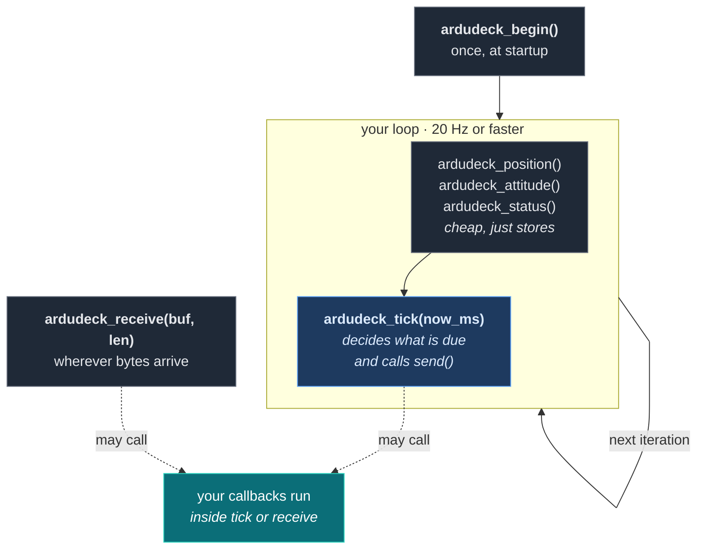
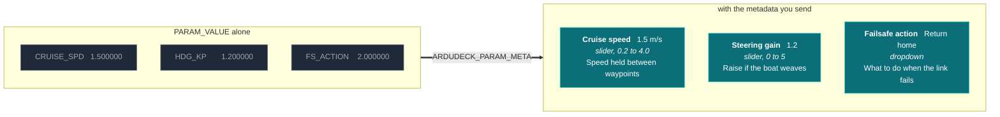
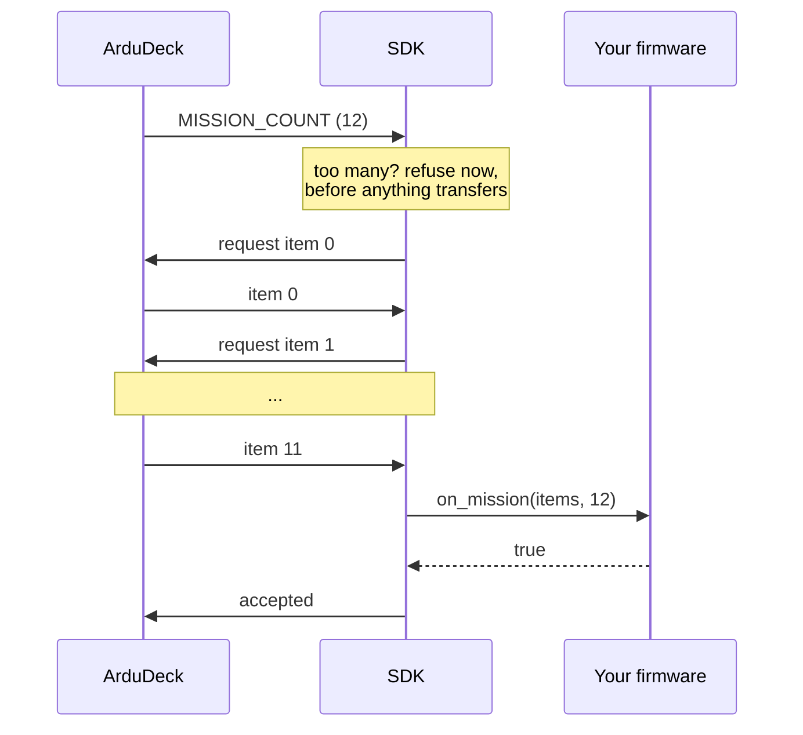

# API reference

Everything public lives in `ardudeck.h`. There are no other headers to include.

Jump to: [Lifecycle](#lifecycle) · [Telling it your state](#telling-it-your-state) ·
[Describing the vehicle](#describing-the-vehicle) · [Parameters](#parameters) ·
[Missions](#missions) · [Commands](#commands) · [Calibration](#calibration) ·
[Talking to the operator](#talking-to-the-operator) · [Build options](#build-options)

---

## Lifecycle

Three functions. That is the whole runtime.

```c
void ardudeck_begin(const ad_config_t *config);
void ardudeck_receive(const uint8_t *buf, size_t len);
void ardudeck_tick(uint32_t now_ms);
```

| | |
|---|---|
| `ardudeck_begin` | Call once. **Everything you pass must outlive it**, because nothing is copied. Does nothing at all if `send` or `now_ms` is NULL. |
| `ardudeck_receive` | Any size, any split, one byte at a time is fine. |
| `ardudeck_tick` | 20 Hz or faster. This is what actually sends. |



> **Feeding state is not sending.** `ardudeck_position()` stores a number and returns.
> Nothing goes out until `ardudeck_tick()` runs, which is why a loop that feeds state and
> never ticks produces complete silence.

### The config

```c
typedef struct {
  const ad_capability_t *caps;

  const ad_param_t *params;
  uint16_t          param_count;

  const ad_calibration_t *calibrations;
  uint8_t                 calibration_count;

  void     (*send)(const uint8_t *buf, size_t len, void *user);   /* required */
  uint32_t (*now_ms)(void);                                       /* required */

  bool (*on_param_set)(const ad_param_t *p, float value, void *user);
  bool (*on_mission)(const ad_wp_t *items, uint16_t count,
                     char *why, size_t why_len, void *user);
  uint16_t (*on_mission_read)(ad_wp_t *items, uint16_t capacity, void *user);
  bool (*on_command)(uint16_t cmd, const float args[7],
                     char *why, size_t why_len, void *user);
  bool (*on_calibrate)(const char *cal_id, ad_cal_action_t action,
                       char *why, size_t why_len, void *user);

  void    *user;
  uint8_t  system_id;      /* 0 means 1 */
  uint8_t  component_id;   /* 0 means 1 */
} ad_config_t;
```

### Threads

**Not thread safe, on purpose.** Locking would tax every user for something most
integrations do not need. Call all three from one task, or hold your own mutex around
them.

Your callbacks run inside `tick` and `receive`, and your `send` can be called from either.
Keep both short.

---

## Telling it your state

Push whatever you have, whenever you have it. The SDK keeps the latest value and sends at
the rate the ground station asked for.

```c
void ardudeck_position(double lat, double lon, float speed_ms, float heading_deg,
                       uint8_t fix, uint8_t sats);
void ardudeck_altitude(float amsl_m, float relative_m, float climb_ms);
void ardudeck_attitude(float roll, float pitch, float yaw);      /* radians */
void ardudeck_status(uint16_t mode, uint16_t active_item, float battery_v, bool armed);
void ardudeck_battery(float volts, float amps, int8_t percent);  /* -1 unknown */
void ardudeck_home(double lat, double lon, float alt);
void ardudeck_rc(const uint16_t *channels, uint8_t count, uint8_t rssi);
```

> ### Absent is not zero
>
> Every setter has a way to say *unknown*, and you should use it.
>
> | Reading | Say unknown with |
> |---|---|
> | No GPS fix | `fix = 0`, and the position is withheld entirely |
> | No battery monitor | do not call `ardudeck_battery` |
> | No percentage | `percent = -1` |
>
> A vehicle with no GPS that reports `0, 0` puts a marker in the Gulf of Guinea, and
> somebody walks toward the sea looking for it.

### Rate limits

```c
void ardudeck_rate_limit(ad_stream_t stream, float max_hz);
```

`AD_STREAM_POSITION`, `AD_STREAM_ATTITUDE`, `AD_STREAM_STATUS`, `AD_STREAM_RC`.
`0.0f` turns a stream off. See [transports.md](transports.md) for defaults.

---

## Describing the vehicle

```c
typedef struct {
  const char *vendor;        /* "acme"       */
  const char *model;         /* "quad v2"    */
  const char *firmware;      /* "1.4.0"      */
  const char *uid;           /* stable per airframe, or NULL */
  ad_frame_t  frame;
  uint32_t    features;

  const uint16_t *mission_cmds;       /* MAV_CMD values you honour, at most 32 */
  uint16_t        mission_cmd_count;
  uint16_t        mission_capacity;

  const ad_mode_t *modes;
  uint8_t          mode_count;
} ad_capability_t;
```

### Frames

`AD_FRAME_MULTIROTOR`, `FIXED_WING`, `VTOL`, `HELICOPTER`, `ROVER`, `SURFACE_BOAT`,
`SUBMARINE`, `ANTENNA_TRACKER`, `UNKNOWN`.

Picks the icon, the HUD layout, and whether altitude is treated as a first-class reading.

### Features

| Bit | Unlocks | You must also |
|---|---|---|
| `AD_FEAT_PARAMS` | Parameter editor, history, backup | supply a param table |
| `AD_FEAT_MISSION` | Mission planner, survey, upload | list `mission_cmds`, set `on_mission` |
| `AD_FEAT_MISSION_READ` | Reading a stored plan back | set `on_mission_read` |
| `AD_FEAT_COMMANDS` | Arm, mode change, start, pause, return | set `on_command` |
| `AD_FEAT_CALIBRATION` | Calibration screens | declare calibrations |
| `AD_FEAT_HOME` | Home marker, distance home | call `ardudeck_home()` |
| `AD_FEAT_TERRAIN` | Terrain-relative mission altitudes | accept `AD_ALT_TERRAIN` |
| `AD_FEAT_RC_REPORT` | Receiver channel readout | call `ardudeck_rc()` |

**Reserved, do not set:** `AD_FEAT_GEOFENCE`, `AD_FEAT_MANUAL_CONTROL`,
`AD_FEAT_LOG_DOWNLOAD`. The bit numbers are fixed so they never move, but there is no
protocol behind them yet. Setting one advertises a screen that cannot work, and the
conformance tool fails you for it.

### Modes

```c
typedef struct {
  uint16_t    id;      /* what your firmware calls it */
  const char *name;    /* up to 16 chars, shown in the picker */
  uint8_t     flags;
} ad_mode_t;
```

| Flag | Meaning |
|---|---|
| `AD_MODE_LOCAL_ONLY` | Exists, but the ground station may not switch into it |
| `AD_MODE_ARMED_ONLY` | Greyed out while disarmed |
| `AD_MODE_TERMINAL` | Reached, not chosen. A finished or failed state |

---

## Parameters

```c
static const ad_param_t PARAMS[] = {
  AD_F32("CRUISE_SPD", &cfg.cruise_ms, 0.2f, 4.0f, "m/s",
         "Speed held between waypoints"),
  AD_I32("LINK_TIMEOUT", &cfg.timeout_s, 1, 120, "s",
         "Silence before the failsafe fires"),
  AD_U8("MOTOR_COUNT", &cfg.motors, 1, 8, "", "How many thrusters are fitted"),
  AD_F32_REBOOT("BATT_DIVIDER", &cfg.divider, 1.0f, 20.0f, "",
                "Voltage divider on the sense pin"),
  AD_ENUM("FS_ACTION", fs_get, fs_set, FS_OPTIONS, 4,
          "What to do when the link fails"),
};
```

Every macro is `(NAME, POINTER, MIN, MAX, UNIT, HELP)`. `AD_F32_REBOOT` marks a value
read once at boot, so the editor offers a reboot after writing it. `AD_ENUM` takes a
getter and setter instead of a pointer, because the wire carries a number and your
storage may not.



The numbers on the left are what `PARAM_VALUE` carries. Everything that makes them
editable rather than guessable is in the metadata, and the SDK sends it for you from your
table.

### Rules that are not negotiable

- **Names are permanent.** Up to 16 characters, `A-Z 0-9 _`. Renaming one breaks every
  saved file, every backup, and every tune anybody wrote on paper.
- **Every parameter needs a description.** One line, saying what changing it does, not
  what it is called. The conformance tool fails you without it.
- **A unit is optional**, because a pure gain genuinely has none.

### Writes

```c
bool on_param_set(const ad_param_t *p, float value, void *user);
```

Called **after** the SDK has clamped the value to your range and written it. Persist here.
Return `false` if the write failed, and the operator sees the field revert.

Either way the SDK answers with whatever the value is **now**, so a clamped write shows
the truth rather than what was typed.

### When your firmware changes a value itself

```c
void ardudeck_param_changed(const char *name);
```

Call it for every value. A calibration that writes six offsets silently leaves a stale
screen, and the next save undoes it.

---

## Missions

```c
typedef struct {
  uint16_t seq;
  uint16_t command;      /* AD_NAV_WAYPOINT, etc. */
  uint8_t  alt_frame;    /* AD_ALT_ASL | AD_ALT_RELATIVE | AD_ALT_TERRAIN */
  double   lat, lon;     /* degrees */
  float    alt;          /* metres, in alt_frame */
  float    p1, p2, p3, p4;
} ad_wp_t;
```

```c
bool on_mission(const ad_wp_t *items, uint16_t count,
                char *why, size_t why_len, void *user);
```

You get **the whole plan at once**, ordered, with no gaps, already filtered to the
commands you declared. `items` is valid only during the call, so copy what you keep.

Geofence and rally uploads ride the same protocol and are refused by the SDK before they
reach you, so anything arriving here is genuinely a flight plan.

Refuse with a sentence:

```c
if (!nav_load(items, count)) {
  snprintf(why, why_len, "Only %d waypoints fit", NAV_MAX_ITEMS);
  return false;
}
return true;
```

The operator reads that sentence. "Command failed" tells them nothing.

### The handshake, which is not yours to worry about



The SDK handles retries, out-of-order items and timeouts. A lost frame causes a
re-request, not a failed upload.

### Commands you can declare

`AD_NAV_WAYPOINT`, `AD_NAV_LOITER_UNLIM`, `AD_NAV_LOITER_TIME`,
`AD_NAV_RETURN_TO_LAUNCH`, `AD_NAV_LAND`, `AD_NAV_TAKEOFF`, `AD_NAV_SPLINE_WAYPOINT`,
`AD_DO_SET_SPEED`, `AD_DO_SET_SERVO`, `AD_DO_DIGICAM_CONTROL`.

These are MAVLink `MAV_CMD` numbers on purpose, so a plan written for your vehicle stays
readable by every other tool that exists.

---

## Commands

```c
bool on_command(uint16_t cmd, const float args[7],
                char *why, size_t why_len, void *user);
```

These are the commands a ground station actually sends. There is no point handling
others: nothing will ever send them.

| Command | You receive | Notes |
|---|---|---|
| `AD_CMD_ARM` | `a[0]` 1 arm, 0 disarm. `a[1]` 21196 means forced | |
| `AD_CMD_SET_MODE` | `a[0]` a mode id **from your own table** | |
| `AD_CMD_RETURN_HOME` | nothing | |
| `AD_CMD_TAKEOFF` | `a[0]` altitude in metres | |
| `AD_CMD_START_MISSION` | nothing | see below |

> ### The SDK unpacks these for you
>
> On the wire, `DO_SET_MODE` carries the mode in **param2**, behind a base-mode bitmask
> in param1 whose bit 0 decides whether param2 is a mode at all. `NAV_TAKEOFF` carries
> altitude in **param7**. Read `a[0]` for either and you would get a bitmask or a zero.
>
> The SDK unpacks both, so `a[0]` means what the table says. If you implement the
> contract without the SDK, that unpacking is yours to do.

> ### A mission start is preceded by a mode change
>
> ArduDeck switches the vehicle to its automatic mode first, waits about 300 ms, then
> sends `AD_CMD_START_MISSION` with no arguments. So your `on_command` sees
> `AD_CMD_SET_MODE` and then, shortly after, the start. Do not expect a start on its own.

> **Acknowledge before you act.** The SDK sends the acknowledgement the moment your
> callback returns. A command that reboots or blocks for 400 ms looks identical to one
> that was ignored, and the operator presses it again.

Some ground stations send the legacy `SET_MODE` message instead of, or as well as,
`DO_SET_MODE`. The SDK accepts both and suppresses the duplicate, so a mode change fires
your callback once however it arrived.

---

## Calibration

Covered properly in [calibration.md](calibration.md). The signatures:

```c
bool on_calibrate(const char *cal_id, ad_cal_action_t action,
                  char *why, size_t why_len, void *user);

void ardudeck_cal_progress(const char *cal_id, const ad_cal_progress_t *progress);
void ardudeck_cal_done(const char *cal_id, bool ok, float quality, const char *detail);
```

Actions are `AD_CAL_START`, `AD_CAL_ACCEPT`, `AD_CAL_CANCEL`, `AD_CAL_SAVE`.

---

## Talking to the operator

```c
void ardudeck_notify(ad_severity_t severity, const char *text);
```

`AD_INFO`, `AD_NOTICE`, `AD_WARNING`, `AD_CRITICAL`. Critical raises an alert; the rest
scroll in the message panel. This is the right home for whatever your firmware already
logs at boot.

```c
bool ardudeck_linked(void);
```

True once any ground station has been heard from. Never required, occasionally useful.

---

## Build options

Define before including, or in your own `ardudeck_conf.h` earlier on the include path.
Unused features compile out entirely.

| Option | Default | Effect |
|---|---|---|
| `AD_MAX_MISSION_ITEMS` | 64 | 0 removes mission support |
| `AD_MAX_PARAMS` | 128 | 0 removes parameter support |
| `AD_MAX_CALIBRATIONS` | 8 | 0 removes calibration support |
| `AD_WITH_COMMANDS` | 1 | 0 removes command support |
| `AD_RX_BUFFER` | 280 | Must be at least 255 |
| `AD_DEFAULT_SYSTEM_ID` | 1 | |
| `AD_MANIFEST_SEARCH_MS` | 3000 | How often to re-describe while nobody answers |
| `AD_CAL_PROGRESS_HZ` | 5 | Ceiling on calibration progress frames |

### Measured size

`cc -Os` on x86-64, which is the machine the tests run on. Treat as an order of
magnitude, not a budget.

| Build | Code | RAM |
|---|---|---|
| telemetry only | 5.4 KB | 968 B |
| everything, 64 mission items, 128 params | 10.7 KB | 4.0 KB |

The entire C library the SDK uses is `memcpy`, `memset` and `strncmp`.

---

[Getting started](getting-started.md) · [Contract](contract.md) · **API** · [Calibration](calibration.md) · [Links](transports.md) · [Conformance](conformance.md) · [Troubleshooting](troubleshooting.md)
