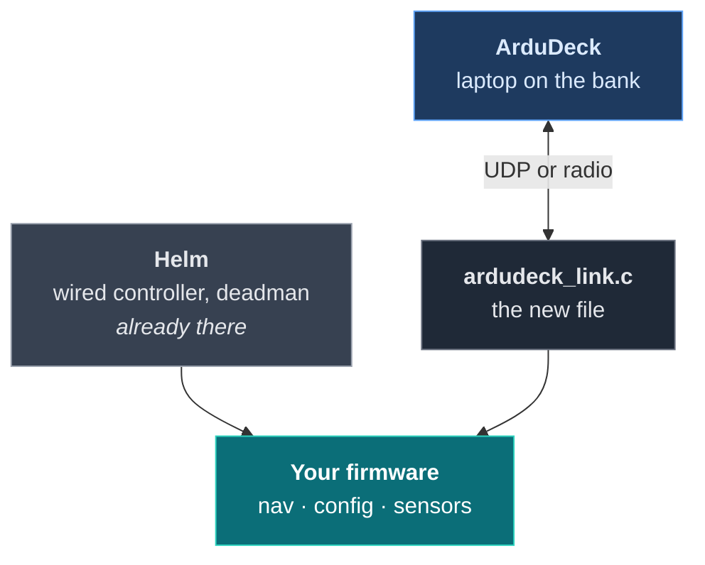

# Build a boat

A surface vessel with a helm: there is a physical controller on the hull that owns the
drives, and ArduDeck is the second way in, from the bank.

That arrangement is the common one on anything crewed or tended, and it is the reason this
guide exists separately from [Build a rover](build-a-rover.md). Adding a ground station to
a vehicle that already has a way to drive it is a different problem from adding one to a
vehicle that has none.

The finished file is [`examples/boat/ardudeck_link.c`](examples/boat/ardudeck_link.c).



---

## Before you start

| | How |
|---|---|
| **The SDK** | `git clone https://github.com/rubenCodeforges/ardudeck-vehicle-sdk` |
| **ArduDeck** | Free for Windows, macOS and Linux: **[ardudeck.com](https://ardudeck.com/#download)** |

The SDK is the library your firmware compiles against; ArduDeck is the application on your
laptop. You need both.

If you want something that runs before you read, [Build a rover](build-a-rover.md) builds
and flies on your desktop in one command.

---

## Step 1: get the SDK, and get ArduDeck

Two separate downloads. One is the library your firmware compiles against; the other is
the application on your laptop.

Clone the SDK **beside** your firmware, not inside it:

```sh
cd ~/projects          # wherever your firmware folder lives
git clone https://github.com/rubenCodeforges/ardudeck-vehicle-sdk
```

```
~/projects/
  your-firmware/
  ardudeck-vehicle-sdk/     <- what you just cloned
```

Then add it to your build. On ESP-IDF that is two lines, and the second is the one people
miss, because without it the component builds fine and your own file still cannot find
`ardudeck.h`:

```yaml
# main/idf_component.yml
dependencies:
  ardudeck:
    path: ../../ardudeck-vehicle-sdk
```

```cmake
idf_component_register(
    SRCS "app_main.c" "ardudeck_link.c"
    INCLUDE_DIRS "."
    REQUIRES ardudeck          # without this, ardudeck.h is not on the include path
)
```

Any other build system is one line: see [Getting started](getting-started.md#step-1-add-the-library).

ArduDeck itself is a free download for Windows, macOS and Linux:
**[ardudeck.com](https://ardudeck.com/#download)**.

---

## Step 2: what a boat is, and is not

A surface vessel has no altitude worth reporting and no attitude anybody wants a horizon
drawn from. Declare the frame and leave those alone:

```c src=examples/boat/ardudeck_link.c
static const ad_capability_t CAPS = {
  .vendor = "acme",
  .model = "survey cat 1200",
  .firmware = "2.3.0",
  .frame = AD_FRAME_SURFACE_BOAT,
  .features = AD_FEAT_PARAMS | AD_FEAT_MISSION | AD_FEAT_MISSION_READ |
              AD_FEAT_COMMANDS | AD_FEAT_CALIBRATION | AD_FEAT_HOME,
  .mission_cmds = MISSION_CMDS,
  .mission_cmd_count = AD_COUNT(MISSION_CMDS),
  .mission_capacity = NAV_MAX_ITEMS,
  .modes = MODES,
  .mode_count = AD_COUNT(MODES),
};
```

`AD_FRAME_SURFACE_BOAT` is what puts a boat on the map rather than a generic marker, and
it is what stops ArduDeck offering you a takeoff button.

The conformance tool will note that with no attitude the horizon will not move. That is a
statement of fact, not a complaint. **Do not send zeros to silence it**: a confident level
attitude from a vehicle that has no idea is worse than none.

One thing a boat does get right that an aircraft does not have to think about:

```c src=examples/boat/ardudeck_link.c
    ardudeck_position(gps_lat(), gps_lon(), gps_speed_ms(), compass_heading_deg(),
                      (uint8_t)gps_fix(), (uint8_t)gps_sats());
```

Heading comes from the **compass**, not from course over ground. A hull being set sideways
by a current is pointing somewhere other than where it is going, and the icon should show
where it is pointing. Send the course instead and the boat on screen will look like it is
crabbing when it is not, or worse, look straight when it is.

---

## Step 3: the mode a ground station may not have

Here is the part that only appears when something else can already drive the vehicle.

The helm is a physical controller wired to the drives, with its own deadman. A laptop on
the bank cannot hold that switch. If it could select the mode that depends on it, the boat
would be in a mode whose safety mechanism is not attached to anything.

So it is declared, and refused:

```c src=examples/boat/ardudeck_link.c
static const ad_mode_t MODES[] = {
  {NAV_STANDBY, "Standby",  0},
  {NAV_TRANSIT, "Transit",  AD_MODE_MISSION},   /* the mode that runs a plan */
  /* Holding a position against wind and current, which a boat can do and a wing cannot. */
  {NAV_STATION, "Station",  0},
  {NAV_RETURN,  "Return",   0},
  {NAV_MOORED,  "Moored",   AD_MODE_TERMINAL},
```

Declaring it rather than hiding it is the point. An operator watching the boat sit there
ignoring them sees **Helm**, greyed out, and understands immediately. Leave it out of the
table and they see a mode number with no name and start rebooting things.

The same logic extends to commands. While somebody is holding the deadman, the bank does
not get to steer:

```c src=examples/boat/ardudeck_link.c
  /* Nothing from the bank while somebody is holding the deadman on the hull. */
  if (helm_has_control() && cmd != AD_CMD_RETURN_HOME) {
    snprintf(why, why_len, "The helm has control");
    return false;
  }
```

Return home stays available on purpose. It is the one thing you want to work when the
person on the hull is the problem.

---

## Step 4: one validator, two ways in

Your firmware already decides what a valid plan is, because the helm can load one too. Do
not write that logic twice:

```c src=examples/boat/ardudeck_link.c
static bool on_mission(const ad_wp_t *items, uint16_t count, char *why, size_t why_len,
                       void *user) {
  (void)user;
  /* The same loader the boat's own controller uses, so there is one set of rules about
     what a valid plan is rather than two that drift. */
  if (nav_load(items, count) == 0) return true;
  /* The operator reads this sentence, so it has to say something they can act on. */
  snprintf(why, why_len, "Could not store %u waypoints", count);
  return false;
}
```

Two validators drift. The day they disagree is the day a plan the helm accepts is one the
laptop rejects, on the same boat, with no explanation at either end.

Because two things can load a plan, being able to read one back matters more here than on
a vehicle with a single source. Declare `AD_FEAT_MISSION_READ` and implement it:

```c src=examples/boat/ardudeck_link.c
static uint16_t on_mission_read(ad_wp_t *items, uint16_t capacity, void *user) {
  (void)user;
  const int n = nav_read(items, capacity);
  return n < 0 ? 0 : (uint16_t)n;
}
```

Now an operator arriving at a boat that is already loaded can see what is on it instead of
overwriting it to find out. It also lets the conformance tool test missions without
destroying a stored plan.

---

## Step 5: a calibration the operator performs on the water

Nobody is going to pick a boat up and hold it nose down, so the accelerometer poses that
suit an aircraft are useless here. A compass on a hull is settled by turning the hull,
which is a **coverage** routine: it ends when enough headings have been seen, however that
happens.

```c src=examples/boat/ardudeck_link.c
static const ad_cal_track_t COMPASS_TRACKS[] = {
  {"Headings covered", "",    12.0f},
  {"Total rotation",   "deg", 720.0f},
};

static const ad_calibration_t CALS[] = {
  {
    .id = "compass",
    .name = "Compass",
    .kind = AD_CAL_COVERAGE,
    .requirements = AD_CAL_REQ_DISARMED,
    .warning = "Turn the boat through two full circles, on the water and away from "
               "steel hulls, pontoons and the launch ramp.",
    .tracks = COMPASS_TRACKS,
    .track_count = AD_COUNT(COMPASS_TRACKS),
  },
};
```

The warning is where your knowledge of the vehicle goes. "Away from the launch ramp" is
the kind of thing only someone who has calibrated one of these badly knows to say, and it
is the difference between one attempt and three.

Report progress as it comes in, then finish:

```c
ardudeck_cal_progress("compass", &(ad_cal_progress_t){
  .track = {headings_seen, total_rotation_deg},
  .percent = pct,
  .hint = turning_too_fast ? "Turn more slowly" : NULL,
});

ardudeck_cal_done("compass", true, 0.91f, "Offsets stored");
ardudeck_param_changed("MAG_OFS_X");   /* for every value the routine wrote */
```

That last line is the one people forget. A routine that writes offsets without
re-announcing them leaves the parameter editor showing the old values, and the next time
anyone presses save the calibration is undone.

---

## Step 6: say things the operator would not otherwise see

A boat has sensors nobody is watching a screen for. Push what matters:

```c src=examples/boat/ardudeck_link.c
    if (cfg.shallow_alarm_m > 0.0f && depth_m() > 0.0f &&
        depth_m() < cfg.shallow_alarm_m) {
      ardudeck_notify(AD_WARNING, "Shallow water");
    }
```

`ardudeck_notify` puts a line in the operator's message panel unprompted. Use it for the
things that need a person, not for a running commentary; a panel that scrolls is a panel
nobody reads.

---

## Step 7: run both at once

Connect ArduDeck while the helm is live, then try to break it:

1. Upload a plan from the laptop, then read it back from the helm. Same plan.
2. Change `TRANSIT_SPD` in ArduDeck and check the helm's own display of it.
3. Take the deadman on the hull. Commands from the bank should be refused, in words.
4. Start a transit from the laptop, then put the laptop down and leave it alone.

That fourth one is where a link failsafe fed by the wrong thing shows itself, because a
ground station watching a mission sends almost nothing besides its heartbeat:

```c
if (ardudeck_silent_for(millis()) > 3000) enter_failsafe();
```

Ask the SDK how long the **ground station** has been quiet. Anything you measure yourself,
like the last time a request arrived, goes silent the moment nobody is asking for
anything, which is exactly when the boat is out on the water doing its job.

---

## Step 8: check it

```sh
make -C conformance                       # once
./conformance/ardudeck-conform --udp 14550
```

Two rungs to read closely on a boat:

- **rung 3, missions** will round-trip a plan rather than skip, because you implemented
  read-back. That is the test actually running instead of declining to overwrite
- **extra, link** stops requesting anything for ten seconds and sends only its heartbeat.
  If your failsafe is fed by request traffic, the boat turns for home right there, on a
  bench, instead of two hundred metres out

---

## The trap of two writers

Read this one twice.

Before the SDK, the helm was the only thing writing your settings. The SDK's callbacks run
on whatever task drives them, and they write **the same settings struct and the same
flash**. Two writers, and on most firmware nothing is stopping them, because until now
there was only ever one.

Either:

- Put a mutex around the settings struct and whatever persists it, and around loading a
  mission, or
- Drive the SDK from the task that already serves the helm, which costs nothing and makes
  the question disappear

Calling **into** the SDK from your existing code is fine when it only sets a flag the SDK
task reads later. Doing real work there is what to avoid. See [Threads](api.md#threads).

---

## Where next

- A vehicle that flies: [Build a quad](build-a-quad.md)
- A wing, and two speeds: [Build a plane](build-a-plane.md)
- The blocks on their own: [Recipes](recipes.md)

---

[Getting started](getting-started.md) · [Examples](examples.md) · [The contract](contract.md) · [API reference](api.md) · [Calibration](calibration.md) · [Links](transports.md) · [ardudeck-conform](conformance.md) · [When it is not working](troubleshooting.md)
