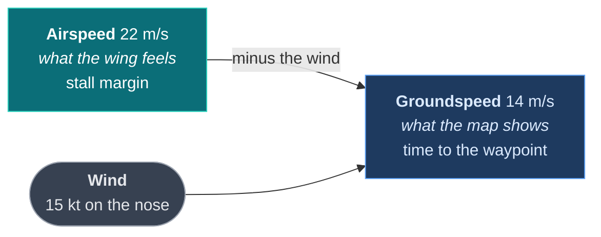

# Build a plane

A fixed wing is not a slow multirotor. It cannot stop, it cannot hover, it has a speed
below which it falls out of the sky, and the speed on its map is not the speed it flies
by. Each of those changes something in the integration.

The finished file is [`examples/plane/ardudeck_link.c`](examples/plane/ardudeck_link.c).
Read [Build a quad](build-a-quad.md) first if you have not done a flying vehicle; this
guide only covers what a wing does differently.

---

## Before you start

| | How |
|---|---|
| **The SDK** | `git clone https://github.com/rubenCodeforges/ardudeck-vehicle-sdk` |
| **ArduDeck 0.1.2 or newer** | Free for Windows, macOS and Linux: **[ardudeck.com](https://ardudeck.com/#download)**. Earlier versions do not read the profile, so your vehicle appears on the map but its parameters, missions and calibrations stay hidden |

The SDK is the library your firmware compiles against; ArduDeck is the application on your
laptop. You need both.

If you want something that runs before you read, [Build a rover](build-a-rover.md) builds
and flies on your desktop in one command.

---

## Step 1: get the SDK, and get ArduDeck

Two separate downloads. One is the library your firmware compiles against; the other is
the application on your laptop.

Clone the SDK **beside** your firmware, not inside it:

```sh
cd ~/projects          # wherever your firmware folder lives
git clone https://github.com/rubenCodeforges/ardudeck-vehicle-sdk
```

```
~/projects/
  your-firmware/
  ardudeck-vehicle-sdk/     <- what you just cloned
```

Then add it to your build. On ESP-IDF that is two lines, and the second is the one people
miss, because without it the component builds fine and your own file still cannot find
`ardudeck.h`:

```yaml
# main/idf_component.yml
dependencies:
  ardudeck:
    path: ../../ardudeck-vehicle-sdk
```

```cmake
idf_component_register(
    SRCS "app_main.c" "ardudeck_link.c"
    INCLUDE_DIRS "."
    REQUIRES ardudeck          # without this, ardudeck.h is not on the include path
)
```

Any other build system is one line: see [Getting started](getting-started.md#step-1-add-the-library).

ArduDeck itself is a free download for Windows, macOS and Linux:
**[ardudeck.com](https://ardudeck.com/#download)**.

---

## Step 2: two speeds, and only one of them stalls you

This is the one that matters most and the one nothing else in these examples needs.

**Groundspeed** is how fast the icon moves across the map. **Airspeed** is what the wing
actually feels, and the number a pilot watches. In still air they are the same. Into a
15 knot wind they are nothing alike, and the aircraft that looks slow on the map is the
one flying comfortably.



Send both:

```c src=examples/plane/ardudeck_link.c
/* speed_ms here is groundspeed: it is what moves the icon across the map. */
ardudeck_position(gps_lat(), gps_lon(), gps_speed_ms(), heading_deg(),
                  (uint8_t)gps_fix(), (uint8_t)gps_sats());
/* And this is the one the pilot flies by. Into wind they are nothing alike. */
ardudeck_airspeed(airspeed_ms());
```

If you never call `ardudeck_airspeed`, the airspeed shown is the groundspeed you already
reported, which is the best guess available and correct in still air. **Do not call it if
you have no sensor.** An invented airspeed on a fixed wing is worse than an honest
groundspeed, because the number people are watching for a stall margin would be fiction.

---

## Step 3: a loiter that is a circle

A multirotor holds position. A wing holds a circle, and the radius is a real setting the
operator needs to see, because it is the difference between orbiting the field and
orbiting the next one.

```c src=examples/plane/ardudeck_link.c
  /* A wing cannot hold position, so its loiter is a circle at LOITER_RAD. */
  {MODE_LOITER,   "Loiter",   0},
```

Expose the radius as a parameter and say what it is for:

```c src=examples/plane/ardudeck_link.c
  AD_F32("LOITER_RAD", &cfg.loiter_radius_m, 20.0f, 500.0f, "m",
         "Radius of the circle it flies when holding. A wing cannot stop"),
```

The description is doing real work there. An operator who has only flown multirotors will
read "Loiter" and expect the aircraft to stop; one line in the parameter editor is where
that misunderstanding gets corrected, before it matters.

---

## Step 4: the speeds that keep it flying

Two parameters do more for safety than anything else you will expose:

```c src=examples/plane/ardudeck_link.c
  AD_F32("TRIM_ARSPD", &cfg.trim_airspeed_ms, 8.0f, 40.0f, "m/s",
         "Airspeed it cruises at. Below MIN_ARSPD it will not hold height"),
  AD_F32("MIN_ARSPD", &cfg.min_airspeed_ms, 5.0f, 30.0f, "m/s",
         "Never commanded below this. Set it above your measured stall"),
```

Ranges are not decoration here. A minimum airspeed of 5 m/s is survivable on a light
foamie and a crash on anything with a wing loading; the range you declare is what stops
an operator typing a number that reads fine and flies badly. Pick the range your airframe
can actually live with, not the range the datatype allows.

---

## Step 5: takeoff, when there is nothing to climb vertically

`AD_CMD_TAKEOFF` hands you an altitude in `a[0]`. That is the right question for a
multirotor and only half of one for a wing, which needs a climb angle and either a runway
or a pair of hands.

Take the number as the target, use your own launch pitch to get there, and refuse the
cases that cannot work:

```c src=examples/plane/ardudeck_link.c
    case AD_CMD_TAKEOFF:
      /*
       * a[0] is the altitude for a vehicle that climbs vertically. A wing does not: it
       * needs a climb angle and a runway or a pair of hands. Take the number as the
       * target height and use your own launch pitch to get there.
       */
      if (!is_armed()) {
        snprintf(why, why_len, "Arm it first");
        return false;
      }
      if (airspeed_ms() > 2.0f) {
        snprintf(why, why_len, "Already moving. Launch it by hand from FBWA instead");
        return false;
      }
      return fc_takeoff(cfg.pitch_limit_deg) == 0;
```

That second refusal is the kind of thing only you know to write. Somebody pressing takeoff
on an aircraft already rolling wants a different mode, and being told so is better than
being obeyed.

Land gets `AD_MODE_ARMED_ONLY` for the same reason it does on a quad, only more so:
a wing's landing is a committed approach, so offering it on the ground offers a crash.

---

## Step 6: the two calibration shapes nothing else uses

A plane is where the other half of the calibration model earns its place.

**Instant.** An airspeed zero is: cover the pitot, wait, done. Nothing to hold, nothing to
move, no progress bar worth drawing.

```c src=examples/plane/ardudeck_link.c
  {
    .id = "airspeed",
    .name = "Airspeed zero",
    .kind = AD_CAL_INSTANT,
    .requirements = AD_CAL_REQ_DISARMED | AD_CAL_REQ_STATIONARY,
    .warning = "Cover the pitot tube with your hand and keep it out of the wind. "
               "A breeze during this becomes a permanent offset.",
  },
```

**Sweep.** Control throws are checked by moving one input end to end while the vehicle
watches what the surfaces did. `prompt` is what to move, in your words:

```c src=examples/plane/ardudeck_link.c
  {
    .id = "throws",
    .name = "Control throws",
    .kind = AD_CAL_SWEEP,
    .requirements = AD_CAL_REQ_DISARMED | AD_CAL_REQ_PROPS_OFF,
    .warning = "The surfaces will move. Keep your fingers clear of the linkages.",
    .prompt = "Move the right stick fully left, right, forward and back",
  },
```

`AD_CAL_REQ_PROPS_OFF` puts a blocking confirmation naming propellers in front of it. You
do not write that dialog; you declare that this routine moves things.

With the level routine, which is positional with a single pose, one aircraft ends up
demonstrating all four shapes. The full set is in [Calibration](calibration.md).

---

## Step 7: check it

```sh
make -C conformance                       # once
./conformance/ardudeck-conform --udp 14550
```

Read three lines closely on a wing:

- **rung 0** should show attitude arriving. A fixed wing without an attitude report leaves
  the horizon still while it banks, which is the instrument a pilot looks at most
- **extra, calibration** starts a safe routine and cancels it. Note it will not start the
  throws sweep, because that one declares `AD_CAL_REQ_PROPS_OFF` and the tool never starts
  anything that moves a control surface unattended
- **extra, link** goes quiet for ten seconds. A wing that turns for home there has a
  failsafe fed by request traffic, and finding that on a bench is worth the whole exercise

---

## The trap of two writers

Read this one twice, because it is the thing most likely to bite you.

If your firmware already has a way to drive it, a transmitter, a command line, an app, then
that path has always been the only thing writing your settings. The SDK's callbacks run on
whatever task drives them, and they write **the same settings struct and the same flash**.

Either put a mutex around the settings, the mission and the vehicle state, or drive the SDK
from the task that already serves your own interface. Calling into the SDK from elsewhere
is fine when it only sets a flag the SDK task reads later.

`rover-fc` takes the first route with one `platform_lock`; `quadfc` takes the second, with
the SDK owned entirely by its link task. Both are in [Threads](api.md#threads).

---

## Where next

- The hovering equivalent: [Build a quad](build-a-quad.md)
- Beside an app you already have: [Build a boat](build-a-boat.md)
- All four calibration shapes: [Calibration](calibration.md)

---

[Getting started](getting-started.md) · [Examples](examples.md) · [The contract](contract.md) · [API reference](api.md) · [Calibration](calibration.md) · [Links](transports.md) · [ardudeck-conform](conformance.md) · [When it is not working](troubleshooting.md)
