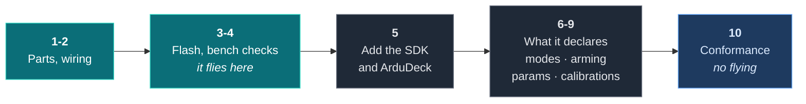
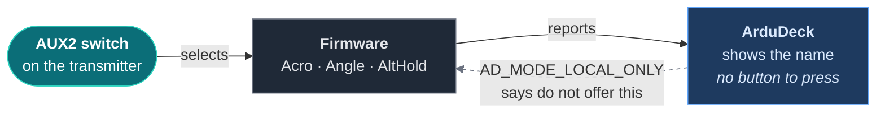
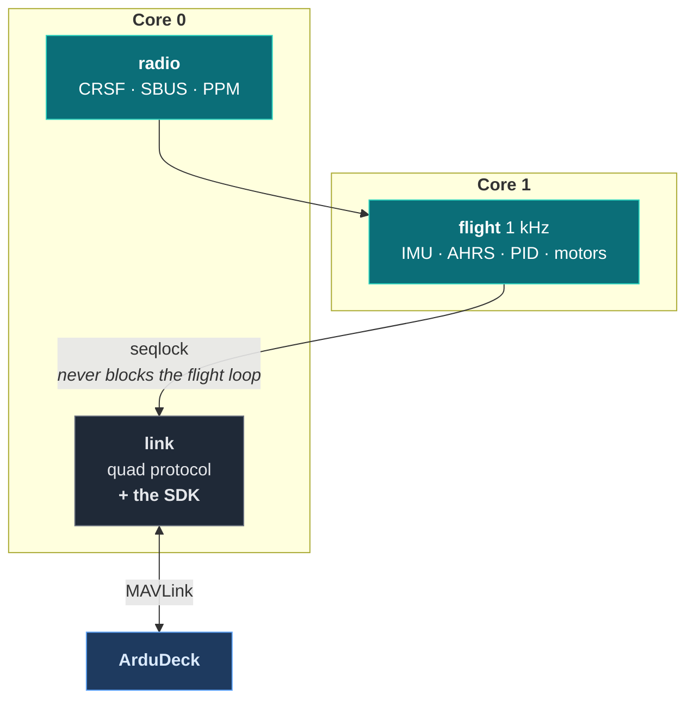

# Build a quad

A real multirotor: an ESP32, two sensors, four motors, and firmware you flash yourself.
Then ArduDeck on top of it.

The firmware is **`quadfc`**, about 6,400 lines of plain ESP-IDF with no dependencies
beyond the SDK. It was written against these docs by somebody who was not us, which makes
it the honest demonstration: not a sample we wrote to flatter our own contract.



> **No hardware yet?** [`examples/quad`](examples/quad) is a simulated multirotor that
> builds and flies on your desktop in one command. It covers the same integration without
> anything to solder. Come back here when the parts arrive.

---

## Before you start

Four things, none of which costs anything.

| | How |
|---|---|
| **ESP-IDF v5.3+** | Espressif's toolchain. Follow their [getting started guide](https://docs.espressif.com/projects/esp-idf/en/stable/esp32/get-started/); it installs the compiler, `idf.py` and the flasher |
| **Python 3** | For `qgs.py`, the quad's own command line ground station. Standard library only, nothing to install |
| **The SDK** | `git clone https://github.com/rubenCodeforges/ardudeck-vehicle-sdk` (step 5 says exactly where to put it) |
| **ArduDeck 0.1.2 or newer** | Free for Windows, macOS and Linux: **[ardudeck.com](https://ardudeck.com/#download)**. Earlier versions do not read the profile, so your vehicle appears on the map but its parameters, missions and calibrations stay hidden |

On Windows, do all of this in WSL. The ESP-IDF installer supports Windows natively too,
but every path in this guide assumes a Unix shell.

Check the toolchain is live before you order parts:

```sh
. $IDF_PATH/export.sh
idf.py --version
```

If that prints a version, you are ready.

---

## Step 1: the parts

| Part | What |
|---|---|
| **ESP32 dev board** | Any WROOM-32. Both cores are used: flight on one, radio and links on the other |
| **MPU6050** | Gyro and accelerometer, on I2C |
| **BMP280** | Barometer, same I2C bus. Optional, but without it there is no altitude hold |
| **4 × ESC and motor** | Anything a 5" / 250 mm frame takes. The default PIDs assume roughly that |
| **Receiver** | CRSF, SBUS or PPM. Or none, and fly it over WiFi from `qgs.py` |
| **GPS** | Optional. Without one there is no position, and ArduDeck shows no map marker |
| **Frame, battery, props** | Yours |

Nothing here is a flight controller board. That is the point: it is an ESP32 doing the job
of one, and the SDK does not care which it is.

---

## Step 2: wire it

```
I2C SDA / SCL  (MPU6050 + BMP280)   21 / 22
Receiver UART1 RX / TX (CRSF, SBUS) 16 / 17
PPM                                 4
GPS UART2 RX / TX                   18 / 19
Motors 1..4  (RR, FR, RL, FL)       25, 26, 32, 33
LED / buzzer                        2 / 23
VBAT divider                        34
```

Motor order and prop direction follow Betaflight Quad X, props in: 1 and 4 clockwise, 2
and 3 counter-clockwise. Default IMU orientation is X axis forward, chip facing up;
anything else is the `imu_align` parameter rather than a resolder.

---

## Step 3: flash it

```sh
. $IDF_PATH/export.sh
idf.py set-target esp32
idf.py build flash
```

After boot, UART0 carries the quad's own binary protocol, so ESP-IDF log lines arrive as
`LOG` frames. Use its ground station CLI, not `idf.py monitor`:

```sh
tools/qgs.py --serial /dev/cu.usbserial-0001 telem
```

---

## Step 4: the checks that stop it hurting you

Props **off** for all of this.

1. `telem`: roll right should read positive roll, nose up positive pitch. If not, fix
   `imu_align` rather than rewiring
2. `calacc` on a level surface
3. `motor N 100 --props-off` for each motor: check position and spin direction
4. Check stick directions in the `telem` RC line, then arm in Angle and tilt the frame by
   hand to see the motors respond correctly
5. Default PIDs are a conservative starting point for a 5" quad. Tune `roll_p` and
   `pitch_p`, then D, then I

That is a flying aircraft. Everything after this is about seeing and configuring it from a
laptop instead of a CLI.

---

## Step 5: get the SDK, and get ArduDeck

Two separate downloads. One is the library your firmware compiles against; the other is
the application on your laptop. You need both.

### 5a. The SDK, next to your firmware

Clone it **beside** the firmware, not inside it:

```sh
cd ~/projects          # wherever your firmware folder lives
git clone https://github.com/rubenCodeforges/ardudeck-vehicle-sdk
```

You should end up with the two folders side by side:

```
~/projects/
  quadfc/                   <- your firmware
    main/
    core/
  ardudeck-vehicle-sdk/     <- what you just cloned
    include/
    src/
```

That is what "sibling checkout" means everywhere else in these docs, and it is why the
paths below start with `../../`. Put the SDK somewhere else and change those paths to
match; nothing cares where it lives as long as the path is right.

### 5b. Tell ESP-IDF about it

Two files, one line each.

`main/idf_component.yml`, which says where the component comes from:

```yaml
dependencies:
  ardudeck:
    path: ../../ardudeck-vehicle-sdk
```

`main/CMakeLists.txt`, which says your code uses it. **This is the line people miss.**
Without it the component builds fine and your own file still cannot find `ardudeck.h`:

```cmake
idf_component_register(
    SRCS "app_main.c" "task_link.c" "ardudeck_link.c"
    INCLUDE_DIRS "."
    REQUIRES ardudeck          # without this, ardudeck.h is not on the include path
)
```

Then rebuild and flash as before:

```sh
idf.py build flash
```

### 5c. ArduDeck itself

The application is a separate download for Windows, macOS and Linux:

**[ardudeck.com](https://ardudeck.com/#download)**

Install it like any other app. It is the ground station; the SDK is what makes your
aircraft legible to it.

### 5d. Connect the two

The integration runs beside the quad's own protocol rather than replacing it, and it
offers two ways in. Pick either:

| Over | What to do |
|---|---|
| **WiFi** | Join the aircraft's access point `QUAD-FC`, password `quadcopter`. In ArduDeck, connect to **UDP port 14550** |
| **USB** | Connect to the same serial port `qgs.py` uses, at 57600. MAVLink and the quad's own protocol share the cable, because each side skips the other's frames |

The aircraft broadcasts until ArduDeck answers, then replies to it directly, so there is
no address to type in on either side.

If nothing appears, the usual cause is the console sharing the UART. See
[When it is not working](troubleshooting.md).

Once it connects you get the aircraft on the map with a live horizon, its battery, its RC
channels, all 72 of its parameters, and its three calibrations.

---

## Step 6: modes that live on a switch

Here is the part that only shows up on a real aircraft, and it is the most interesting
thing in this guide.

`quadfc` selects its flight mode with the AUX2 switch on the transmitter. Not with a
command. A ground station cannot move a physical switch, so it must not be able to claim
it did:

```c
static const ad_mode_t MODES[] = {
    { FLIGHT_MODE_ACRO,    "Acro",     AD_MODE_LOCAL_ONLY },
    { FLIGHT_MODE_ANGLE,   "Angle",    AD_MODE_LOCAL_ONLY },
    { FLIGHT_MODE_ALTHOLD, "AltHold",  AD_MODE_LOCAL_ONLY },
    { MODE_FAILSAFE,       "Failsafe", AD_MODE_TERMINAL },
};
```



Every mode is `AD_MODE_LOCAL_ONLY`. ArduDeck shows them by name, so the pilot can see which
one the switch has selected, and offers none of them as a button. `AD_MODE_TERMINAL` on
Failsafe says the same thing about a state the aircraft reaches on its own.

Compare that with the simulated quad, where modes are commandable because nothing else
owns them. Same SDK, opposite answer, because the hardware is different. **That is the
contract doing its job**: the vehicle describes itself and the ground station adapts.

---

## Step 7: arming from a laptop, behind a gate

Arming over a link is the one command where the right default is no.

```c
            if (!PI_(P_ALLOW_LINK_ARM)) {
                snprintf(why, why_len, "Set ALLOW_LINK_ARM to On to arm from here");
```

`ALLOW_LINK_ARM` is a parameter, off by default, and the refusal names it. An operator who
presses arm and reads that sentence knows exactly what to change, without a manual. When
it is on, the aircraft's own prearm checks still apply and refuse with the actual blocker.

Disarm is refused while flying unless forced, which is the same `21196` flag MAVLink uses
everywhere.

---

## Step 8: the parameters it already had

`quadfc` has 72 parameters of its own. The integration exposes the same table under upper
case names, with units, ranges, help text and dropdowns, and:

- writes are saved to flash a second after the last change, and only while disarmed
- changes made from `qgs.py` or by a calibration are announced back to ArduDeck, so two
  ground stations never disagree about what is in the aircraft

That second point is the one people skip. A parameter changed by anything other than
ArduDeck has to be re-announced, or the editor shows a stale value and the next save puts
it back.

Seventy two is where the editor stops being a list and starts being a tool: search,
ranges, and enum dropdowns all start mattering at that size in a way six parameters never
show you.

---

## Step 9: calibrations on real sensors

Three of them: gyro, level and barometer zero. All are instant or positional, none spins a
motor, and cancel is honoured mid-routine.

Notice what is missing: **no compass**, because there is no magnetometer on this build.
A calibration screen for a sensor the aircraft does not have is exactly what the capability
manifest exists to prevent.

---

## Step 10: check it without flying

`quadfc` keeps a host SITL of its ArduDeck integration, so the conformance tool runs with
nothing plugged in:

```sh
make -C ../../ardudeck-vehicle-sdk/conformance
make -C test conform
```

```
PASS  rung 0  position      heartbeat 1.0 Hz, position x40, attitude x49, GPS fix 3
PASS  rung 1  identity      quadfc ESP32 Quad X fw 0.1.0, 4 modes named, 0 mission commands
WARN  rung 2  parameters    72 parameters, 72 with metadata
SKIP  rung 3  missions      not declared
PASS  rung 4  commands      unknown command refused in 6 ms
PASS  extra   calibration   3 declared
PASS  extra   link          10 heartbeats, 80 telemetry in 10 s with nothing requested

6 of 6 tested, 0 failing.
```

Two lines worth reading twice.

**`SKIP rung 3 missions: not declared`.** This is an acro and angle quad flown on sticks.
It has no waypoint navigation, so it claims none, and ArduDeck hides mission planning for
it rather than offering a screen it would ignore. Declaring a capability you cannot serve
is the failure the whole design exists to prevent, and the correct move is to say nothing.

**`PASS extra link`.** Ten seconds where the tool asks for nothing and sends only its
heartbeat, which is what a ground station looks like while somebody watches a flight. An
aircraft whose failsafe is fed by request traffic goes to failsafe right there, on a bench.

---

## Step 11: where the SDK sits in a real firmware

Three tasks, and the SDK is in exactly one of them:

| Task | Core | What |
|---|---|---|
| `flight` | 1 | 1 kHz, hardware timer: IMU, filters, AHRS, baro, modes, PID, mixer, motors, arming |
| `radio` | 0 | CRSF / SBUS / PPM |
| `link` | 0 | The quad's own protocol **and** ArduDeck, plus GPS, battery, LED, buzzer |



The SDK is not thread safe, and this is what that looks like in practice: one task owns
every SDK call, and it is the task that already owned the links. State crosses from the
1 kHz flight loop through a seqlock, so the link task reads a consistent snapshot without
ever blocking the thing flying the aircraft.

If your firmware already has a task serving its own protocol, put the SDK there. It costs
nothing and it answers the threading question before you have to think about it. See
[Threads](api.md#threads).

---

## Where next

- No hardware: [`examples/quad`](examples/quad), a simulated multirotor that flies on your
  desktop
- A wing instead of rotors: [Build a plane](build-a-plane.md)
- Beside an app you already have: [Build a boat](build-a-boat.md)
- The blocks on their own: [Recipes](recipes.md)

---

[Getting started](getting-started.md) · [Examples](examples.md) · [The contract](contract.md) · [API reference](api.md) · [Calibration](calibration.md) · [Links](transports.md) · [ardudeck-conform](conformance.md) · [When it is not working](troubleshooting.md)
