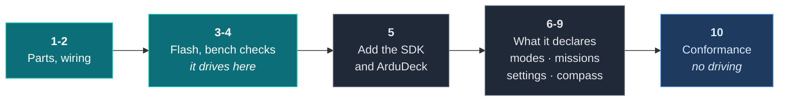

# Build a rover

A real GPS rover: an ESP32, a compass, a steering servo and a car ESC. It drives a list of
waypoints on its own, and you watch it do it from ArduDeck.

The firmware is **`rover-fc`**, about 5,800 lines of plain ESP-IDF with no dependencies
beyond the SDK. It was written against these docs by somebody who was not us, which makes
it the honest demonstration rather than a sample we wrote to flatter our own contract.



> **No hardware yet?** [`examples/rover`](examples/rover) is a simulated rover that builds
> and drives on your desktop in one command, and it is the shortest way to see the whole
> integration. It is covered at the end of this guide. `rover-fc` also ships its own
> desktop simulator running the same firmware, which is better still.

## Before you start

Four things, none of which costs anything.

| | How |
|---|---|
| **ESP-IDF v5.3+** | Espressif's toolchain. Follow their [getting started guide](https://docs.espressif.com/projects/esp-idf/en/stable/esp32/get-started/); it installs the compiler, `idf.py` and the flasher |
| **Python 3** | Standard library only, nothing to install |
| **The SDK** | `git clone https://github.com/rubenCodeforges/ardudeck-vehicle-sdk` (step 5 says exactly where to put it) |
| **ArduDeck 0.1.2 or newer** | Free for Windows, macOS and Linux: **[ardudeck.com](https://ardudeck.com/#download)**. Earlier versions do not read the profile, so your vehicle appears on the map but its parameters, missions and calibrations stay hidden |

On Windows, do all of this in WSL. Check the toolchain works before you order parts:

```sh
. $IDF_PATH/export.sh
idf.py --version
```

---

## Step 1: the parts

| Part | What |
|---|---|
| **ESP32 dev board** | Any WROOM-32. Both cores are used: control on one, radio and links on the other |
| **MPU6050** | Gyro and accelerometer, on I2C |
| **QMC5883L or HMC5883L** | Compass, same I2C bus. This is what gives it a heading standing still |
| **GPS module** | Any NMEA one. Without it there is no position and no waypoints |
| **Steering servo** | Standard hobby servo, or a second ESC for skid steer |
| **Car ESC** | **Reversible**, with neutral at 1500 µs. A plane ESC will not do |
| **Receiver** | CRSF or SBUS. Optional if you only ever drive it from waypoints |
| **Chassis, battery** | Yours |

A rover needs a compass in a way a multirotor does not. Course over ground only tells you
where it went, and a stationary rover has no course at all, so without a magnetometer it
cannot point itself at the first waypoint.

---

## Step 2: wire it

```
I2C SDA / SCL (MPU6050, compass)        21 / 22
Receiver UART1 RX / TX (CRSF or SBUS)   16 / 17
GPS UART2 RX / TX                       18 / 19
OUT1: steering servo, or left ESC       25
OUT2: ESC, or right ESC on skid steer   26
LED / buzzer                            2 / 23
Battery divider                         34
```

Both outputs are 50 Hz servo pulses and both start at 1500 µs before anything else runs,
so the ESC sees neutral from the first millisecond rather than a random pulse width.

Mount the IMU and compass flat with the X arrow forward. Any other compass orientation is
the `hdg.mag_align` setting rather than a resolder.

---

## Step 3: flash it

```sh
. $IDF_PATH/export.sh
idf.py set-target esp32
idf.py build flash monitor
```

It talks in lines of text on USB at 115200, and on UDP 8888 over its own WiFi access point
`ROVER-FC`, password `roverfc123`. Every reply ends in `ok` or `err <reason>`:

```
status
params nav.
set nav.cruise 2.0
save
```

---

## Step 4: the checks before it drives off

Wheels off the ground, or the chassis on a box.

1. `status` and turn the rover by hand: the heading should follow, and north should be
   north. If it is out, fix `hdg.mag_align`
2. `cal compass start`, turn it through two full circles, then `cal compass stop`
3. Check the steering servo goes the right way, and that the ESC actually reverses
4. Put a couple of waypoints in and watch it pick a direction before you let it go:
   ```
   wp add 52.3702 4.8900
   wp add 52.3702 4.8903 0 5
   wp list
   ```
5. `arm`, then `mode auto`

That is a working rover. Everything after this is about seeing and driving it from a
laptop instead of a command line.

---

## Step 5: get the SDK, and get ArduDeck

Two separate downloads. One is the library the firmware compiles against; the other is the
application on your laptop. You need both.

### 5a. The SDK, next to the firmware

Clone it **beside** the firmware, not inside it:

```sh
cd ~/projects          # wherever your firmware folder lives
git clone https://github.com/rubenCodeforges/ardudeck-vehicle-sdk
```

You should end up with the two folders side by side:

```
~/projects/
  rover-fc/                 <- the firmware
    app/
    main/
  ardudeck-vehicle-sdk/     <- what you just cloned
    include/
    src/
```

That is what "sibling checkout" means, and it is why the paths below start with `../../`.

### 5b. Tell ESP-IDF about it

`main/idf_component.yml`:

```yaml
dependencies:
  ardudeck:
    path: ../../ardudeck-vehicle-sdk
```

`main/CMakeLists.txt`. **This is the line people miss.** Without it the component builds
fine and your own file still cannot find `ardudeck.h`:

```cmake
idf_component_register(
    SRCS "app_main.c" "rover_ardudeck.c"
    INCLUDE_DIRS "."
    REQUIRES ardudeck          # without this, ardudeck.h is not on the include path
)
```

Then `idf.py build flash` again.

### 5c. Connect

Join the rover's access point `ROVER-FC`, password `roverfc123`, and connect ArduDeck to
**UDP 14550**. USB stays the text console, so you can have both open at once.

The rover broadcasts until ArduDeck answers, then replies to it directly, so there is no
address to type at either end.

---

## Step 6: modes, and the one the sticks own

Four modes, and they are not all the ground station's to give:

| Mode | Who can select it |
|---|---|
| **Hold** | Anyone. Servo centred, ESC neutral |
| **Auto** | Anyone. Drives the waypoint list. This is the one marked `AD_MODE_MISSION` |
| **RTL** | Anyone. Back to home, which is set at the first arming with a GPS fix |
| **Manual** | The transmitter only, so it is `AD_MODE_LOCAL_ONLY` |

Manual belongs to the sticks. ArduDeck shows it by name so an operator watching the rover
ignore them can see why, and offers no button for it. The rule the whole contract rests
on, applied to one mode: describe what exists, decline what you cannot serve.

---

## Step 7: missions, with the two commands a rover needs

`NAV_WAYPOINT`, where `param1` is how long to wait there, and `DO_CHANGE_SPEED`, which
folds into the waypoints that follow it.

That second one is worth copying. A speed change is not a place, so rather than inventing
a waypoint that does nothing, the firmware applies it to the items after it and rebuilds
those items on the way back out. An upload replaces the stored list and saves it; a
download reconstructs the speed items so what you get back is what you sent.

---

## Step 8: the settings it already had

All 43 of them, each with a unit, a range, help text and a dropdown where the value is a
choice. The mapping is mechanical, `nav.cruise` becomes `NAV_CRUISE`, with one exception:

> `drive.steer_range` becomes `DRIVE_STEER_RNG`, because parameter names are capped at
> **16 characters**.

You will meet that limit. Pick the abbreviation yourself and write it down, because
renaming a parameter later breaks every saved file that mentions it.

Two behaviours worth copying:

- Writes are saved to flash a second after the last change, and only while disarmed
- Changes made from the command line or by a calibration are **re-announced** to ArduDeck

Skip that second one and the editor shows a stale value, then the next save puts the old
number back into the rover.

---

## Step 9: the compass, as a coverage routine

Nobody picks a rover up and holds it nose down, so poses are useless here. The compass is
settled by turning the chassis, which is a **coverage** routine: it finishes by itself
once all twelve directions have been seen.

Save finishes it early with whatever has been gathered, and cancel is honoured mid-routine.
The conformance tool checks exactly that.

---

## Step 10: check it without driving

`rover-fc` ships a desktop simulator running the same `app/` code, so the conformance tool
runs with no board attached:

```sh
make -C ../../ardudeck-vehicle-sdk/conformance
make -C sim conform
```

```
PASS  rung 0  position      heartbeat 1.0 Hz, position x38, attitude x0, GPS fix 3
                            -> no ATTITUDE, so the horizon will not move
PASS  rung 1  identity      rover-fc ESP32 Rover fw 0.1.0, 4 modes named, 2 mission commands
WARN  rung 2  parameters    43 parameters, 43 with metadata
PASS  rung 3  missions      3 items round-tripped, capacity 32, 2 commands declared
PASS  rung 4  commands      unknown command refused in 0 ms
PASS  extra   calibration   1 declared
PASS  extra   link          10 heartbeats, 76 telemetry in 10 s with nothing requested

7 of 7 tested, 0 failing.
```

The attitude note is correct and deliberate. A rover has no roll or pitch worth drawing a
horizon from, so it sends none rather than sending zeros, and the tool reports the
consequence rather than calling it a fault.

`rung 3` passes rather than skipping because the rover can read its stored plan back, so
the tool round-tripped a mission instead of declining to overwrite one.

---

## Step 11: two writers, one lock

Read this one twice, because it is the thing most likely to bite you.

The rover had a text command line on USB and UDP before ArduDeck existed. Both can arm it,
change its mode and load waypoints. The SDK's callbacks run on whatever task drives them,
and they write the same settings, the same mission and the same vehicle state.

`rover-fc` takes one mutex, `platform_lock`, across the vehicle state, the settings and
the mission, so the 50 Hz control loop and the two command paths never write at once. Its
integration reaches the rover only through its public API, so the command line and ArduDeck
go through the same checks and the same lock.

That is the advice in [Threads](api.md#threads), taken. If your firmware already has a way
to drive it, you have this problem the moment you add the SDK, whether or not you have
noticed.

---

## Without any hardware at all

[`examples/rover`](examples/rover) in the SDK is a simulated rover: four files, one
`make`, and it drives a mission on the map. It is the fastest way to see the integration
end to end, and the seam is deliberately visible.

```
examples/rover/
  vehicle.h        what the firmware already offers
  vehicle.c        the firmware. Drives to waypoints. Never mentions ArduDeck
  ardudeck_link.c  the integration. Talks to it only through vehicle.h
  main.c           a loop and a UDP socket
```

```sh
cd ardudeck-vehicle-sdk/examples/rover    # the folder you cloned
make
./rover                                   # then connect ArduDeck to UDP 14550
```

The firmware exposes what any vehicle already has, and note the `const char **why` on
anything that can fail:

```c src=examples/rover/vehicle.h
rover_params_t *rover_params(void);
double        rover_lat(void);
double        rover_lon(void);
float         rover_heading_deg(void);
rover_mode_t  rover_mode(void);
bool          rover_arm(bool arm, const char **why);
bool          rover_set_mode(rover_mode_t mode, const char **why);
bool          rover_load_mission(const rover_wp_t *items, uint16_t count, const char **why);
```

That is not for the SDK. A firmware that can refuse should already be able to say why, and
that string is exactly what the operator needs to read.

The integration is translation and nothing else. Parameters point straight at the
firmware's own struct, so a value written from ArduDeck is the value the control loop reads
on its next pass:

```c src=examples/rover/ardudeck_link.c
rover_params_t *p = rover_params();
table[0] = (ad_param_t)AD_F32("CRUISE_SPD", &p->cruise_speed_ms, 0.2f, 4.0f, "m/s",
                              "Speed held between waypoints");
```

Commands hand back the firmware's own refusal:

```c src=examples/rover/ardudeck_link.c
    case AD_CMD_ARM:
      if (rover_arm(args[0] != 0.0f, &reason)) return true;
      break;
```

```c src=examples/rover/ardudeck_link.c
  snprintf(why, why_len, "%s", reason);
  return false;
```

So the operator reads **"Battery too low to arm"**, not "command denied". And the main loop
shows the split in two lines:

```c src=examples/rover/main.c
    rover_step(0.02f);        /* the firmware, doing what it always did */
    ardudeck_link_tick();     /* the integration, telling ArduDeck about it */
```

`vehicle.c` did not change by one line to get a map, an instrument panel, a parameter
editor, mission upload and a command bar.

---

## Where next

- A vehicle that flies: [Build a quad](build-a-quad.md), also on an ESP32
- A wing, and two speeds: [Build a plane](build-a-plane.md)
- Beside an app you already have: [Build a boat](build-a-boat.md)
- The blocks on their own: [Recipes](recipes.md)

---

[Getting started](getting-started.md) · [Examples](examples.md) · [The contract](contract.md) · [API reference](api.md) · [Calibration](calibration.md) · [Links](transports.md) · [ardudeck-conform](conformance.md) · [When it is not working](troubleshooting.md)
