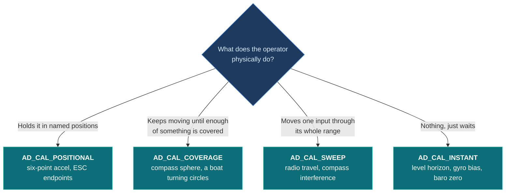
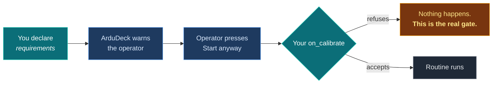

# Calibration

**Your routine stays in your firmware.** Only you see raw sensor samples at rate, and
nobody should be shipping a calibration algorithm over a telemetry link.

What ArduDeck provides is the screen: the instructions, the progress bars, the live 3D
vehicle, the warnings. It builds all of that from a description you write once.

---

## There is no compass calibration in this contract

That is deliberate. Every firmware calibrates differently and a contract that named
specific routines would fit nobody.

Instead there are **four shapes**, which is what every calibration in the field turns out
to be. You say which yours is.



---

## Positional: hold it like this

You send a list of attitudes with a name each. ArduDeck draws your live vehicle against a
ghost in the target pose, and the operator turns it until the two converge.

```c
static const ad_cal_pose_t ACCEL_POSES[] = {
  /* name shown as the instruction, roll, pitch */
  { "Level",      0.0f,   0.0f },
  { "Left side", -90.0f,  0.0f },
  { "Right side", 90.0f,  0.0f },
  { "Nose down",  0.0f, -90.0f },
  { "Nose up",    0.0f,  90.0f },
  { "Inverted", 180.0f,   0.0f },
};
```

It does not care whether you have six poses or two, or what you call them. A vehicle that
calibrates upright and inverted declares two.

When the operator says the pose is held, you get `AD_CAL_ACCEPT`. Report which pose you
are waiting for next:

```c
ardudeck_cal_progress("accel", &(ad_cal_progress_t){
  .step = next_pose_index,
  .step_done = true,          /* the one just captured */
  .percent = (next_pose_index * 100) / 6,
});
```

---

## Coverage: keep moving until enough

You declare up to three **tracks**, each with a target. The operator sees a progress bar
per track and keeps going until they all fill.

Why three and not one? Because some routines settle more than one thing at once. Turning
a boat through two circles by hand settles both the compass hard iron **and** which way
round the gyro counts relative to it, and those can succeed separately. A single
percentage cannot say that. Three tracks can:

```c
static const ad_cal_track_t COMPASS_TRACKS[] = {
  /* label shown to the operator, unit, target */
  { "Sectors turned through", "",    12.0f  },
  { "Total turning",          "deg", 720.0f },
  { "Gyro agreement",         "",    0.7f   },
};
```

Then report as the routine runs, as often as you like:

```c
ardudeck_cal_progress("compass", &(ad_cal_progress_t){
  .track = { sectors_seen, gyro_turn_deg, agreement },
  .percent = pct,
  .hint = turning_too_fast ? "Turn more slowly" : NULL,
});
```

The SDK throttles this to a few per second, so a routine that produces progress at 200 Hz
does not saturate the link. **Pose captures are never throttled**, because that is the
one the operator is waiting on.

---

## Declaring it

```c
static const ad_calibration_t CALS[] = {
  {
    .id   = "compass",
    .name = "Compass",
    .kind = AD_CAL_COVERAGE,
    .requirements = AD_CAL_REQ_DISARMED,
    .warning = "Turn the boat through two full circles by hand, away from "
               "steel and away from the trailer.",
    .tracks = COMPASS_TRACKS, .track_count = 3,
  },
};
```

Then in your config: `.calibrations = CALS, .calibration_count = 1`, and add
`AD_FEAT_CALIBRATION` to your features.

### Use a standard id where one fits

`accel`, `level`, `compass`, `compassmot`, `gyro`, `baro`, `radio`, `esc`, `airspeed`.

**An id outside that list still works.** It gets the generic screen for its shape, under
your own name. A fixed list would be a whitelist, not a contract.

---

## Warnings, and who is actually in charge



**What you declare warns the operator. It never authorises anything.** The ground station
may be older than your firmware, or a different ground station entirely, or lying. If a
routine must not run while armed, refuse it while armed, in your own code.

| Requirement | What the operator sees |
|---|---|
| `AD_CAL_REQ_DISARMED` | Start is disabled while armed |
| `AD_CAL_REQ_STATIONARY` | A prompt to put the vehicle down |
| `AD_CAL_REQ_PROPS_OFF` | A blocking confirmation naming propellers |
| `AD_CAL_REQ_MOTORS_LIVE` | The strongest warning there is, plus hold-to-confirm |
| `AD_CAL_REQ_LOCAL_ONLY` | Listed, but cannot be started remotely at all |
| `AD_CAL_REQ_LEVEL_SURFACE` | A prompt for a surface known to be level |

---

## Finishing

```c
ardudeck_cal_done("compass", true, 0.91f, "Offsets stored, gyro was reversed");
```

`quality` is 0 to 1, or `NAN` if you do not compute one. `detail` is your own sentence and
is shown verbatim.

> ### Then tell the parameter editor
>
> A calibration ends by writing offsets. The editor has no idea.
>
> ```c
> ardudeck_param_changed("MAG_OFS_X");
> ardudeck_param_changed("MAG_OFS_Y");
> ardudeck_param_changed("MAG_OFS_Z");
> ```
>
> Skip this and the screen still shows the old numbers, and the operator's next save
> writes them straight back over the calibration they just did.

---

## Cancel has to work

The operator can press cancel at any point, including halfway through. You get
`AD_CAL_CANCEL` and must stop.

The conformance tool tests exactly this: it starts a harmless calibration and cancels it
immediately. A cancel that is not honoured is a real defect, not a rough edge.

---

[Getting started](getting-started.md) · [Contract](contract.md) · [API](api.md) · **Calibration** · [Links](transports.md) · [Conformance](conformance.md) · [Troubleshooting](troubleshooting.md)
