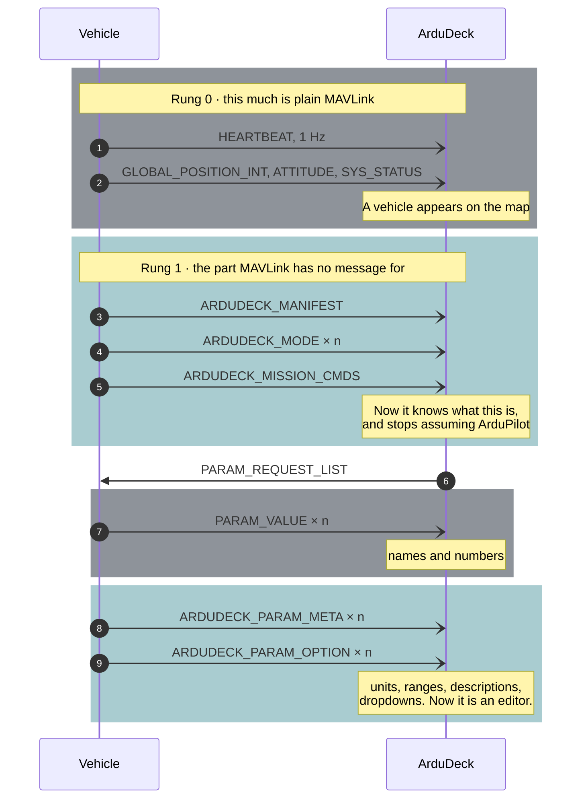

# The contract

What a vehicle must do to get ArduDeck's screens. The SDK in this repository is one way to
satisfy it; implementing it directly is another, and the
[conformance tool](conformance.md) is what tells you whether you got it right either way.

**If you are just getting started, read [getting-started.md](getting-started.md) instead.**
This page is the specification, not the tutorial.

MAVLink already carries position, parameters and missions perfectly well. The three
things it has **no message for** are the only reason this contract exists: what the
vehicle **is**, what its parameters **mean**, and how its calibrations are **shaped**.

Here is a connection from first byte to a usable screen. Standard MAVLink in grey, the
three additions in teal.



Notice what the two grey blocks alone would give you: a dot on a map, and a list of names
with numbers beside them. The teal is the difference between that and a ground station.

**Draft.** Nothing here is frozen, and the message id block is provisional. Do not ship a
product against it yet.

---

## The rule everything follows from

A capability the vehicle does not declare is a screen the ground station does not show.

This is what lets a ground station support firmware it has never seen. It also means the
failure mode of being cautious is a hidden screen, while the failure mode of being
generous is an operator uploading a plan the vehicle will not fly, or pressing a button
that does nothing. **Under-declare, then grow.**

---

## The wire

MAVLink v2. A vehicle already speaking MAVLink needs no new parser, and every other tool
that speaks the protocol still sees it.

Standard messages carry everything MAVLink already models. This profile adds only the
three things it has no message for:

| What | Message |
|---|---|
| What the vehicle **is** | `ARDUDECK_MANIFEST`, `ARDUDECK_MODE`, `ARDUDECK_MISSION_CMDS` |
| What its parameters **mean** | `ARDUDECK_PARAM_META`, `ARDUDECK_PARAM_OPTION` |
| How its calibrations are **shaped** | `ARDUDECK_CAL_DECLARE`, `_POSE`, `_TRACK`, `_CONTROL`, `_PROGRESS`, `_RESULT` |

Definitions live in [`profile/ardudeck.xml`](../profile/ardudeck.xml), which is the source
of truth for both sides. Ids 43000 to 43049 are provisional and not yet registered with
the MAVLink project.

### Two rules about payload length

Both are ordinary MAVLink, and both are where implementations go wrong.

1. **A sender truncates trailing zero bytes**, and the checksum covers only what is left.
2. **A receiver zero-pads a short payload** back to full length before reading fields,
   and never rejects a frame for being short.

A receiver that skips rule 2 reads a checksum byte as a field value. Extension fields are
excluded from the CRC extra so that adding one does not invalidate every deployed
receiver, which also means a sender should populate base fields only: some receivers
reject a frame longer than the length they know.

---

## The rungs

Each is independent. Rung 1 is the one that matters, because it is what stops the ground
station guessing.

### Rung 0, position

`HEARTBEAT` at 1 Hz, plus `GLOBAL_POSITION_INT`, `GPS_RAW_INT`, `VFR_HUD`, `ATTITUDE`,
`SYS_STATUS`.

Report `MAV_AUTOPILOT_GENERIC`. Claiming ArduPilot or PX4 makes a ground station apply
that firmware's conventions to a vehicle that does not share them.

**Absent is not zero.** Fix 0 for no fix, `0xFFFF` for an unknown battery voltage, -1 for
an unknown percentage, and no `GLOBAL_POSITION_INT` at all when there is no position. A
vehicle reporting 0,0 puts a marker in the Gulf of Guinea and somebody flies toward it.

### Rung 1, identity

`ARDUDECK_MANIFEST` on a slow repeat and on request, followed by one `ARDUDECK_MODE` per
flight mode and one `ARDUDECK_MISSION_CMDS`.

Every mode carries a name. Without it the picker shows a number and the operator guesses.
`AD_MODE_LOCAL_ONLY` marks a mode that exists but may not be commanded remotely.

On a broadcast link there is no connect event, so the manifest repeats every few seconds
until something answers, then drops to a slow keepalive.

### Rung 2, parameters

`PARAM_REQUEST_LIST`, `PARAM_REQUEST_READ`, `PARAM_SET`, `PARAM_VALUE` as MAVLink defines
them, plus `ARDUDECK_PARAM_META` for every parameter.

A parameter without a unit and a range is a number in a list. The metadata is most of the
value, not decoration.

- Names are up to 16 characters, `A-Z 0-9 _`, and are permanent. Renaming one breaks
  saved files, backup history and every tune anyone wrote down.
- Every parameter carries a unit and a range. An empty unit is allowed for a pure gain.
- Help is one line: what changing it does, not what it is called.
- A write is answered with `PARAM_VALUE` carrying whatever the value is **now**, so a
  clamped or refused write leaves the editor showing the truth.
- When the firmware changes a value itself, it re-announces it. A calibration that writes
  six offsets silently leaves a stale screen, and the next save undoes it.

### Rung 3, missions

Standard MAVLink mission transfer: `MISSION_COUNT`, `MISSION_REQUEST_INT`,
`MISSION_ITEM_INT`, `MISSION_ACK`, and `MISSION_REQUEST_LIST` for download.

The vehicle declares the `MAV_CMD` values it honours and its capacity. A plan containing
anything else is refused with `MAV_MISSION_UNSUPPORTED`, and one too long with
`MAV_MISSION_NO_SPACE` **before** any items transfer.

A refusal carries the firmware's own sentence in a `STATUSTEXT`. "Command failed" tells
an operator nothing; "No GPS fix, 2 satellites, needs 5" tells them what to do.

An out of order item means a lost frame, not a broken plan: re-request the one still
awaited rather than abandoning the transfer.

**Check `mission_type` on every one of these messages.** A geofence and a rally point set
travel over the identical protocol and are told apart only by that field, so a vehicle
that ignores it will accept a fence upload as a flight plan and then fly the boundary it
was told to stay inside. It is an extension field, so absent means `MISSION`. Refuse any
other type with `MAV_MISSION_UNSUPPORTED` **and echo the type back in the acknowledgement**,
because that is how the sender knows which of its transfers was refused.

### Rung 4, commands

`COMMAND_LONG` in, `COMMAND_ACK` out, for the five a ground station actually sends: arm,
mode change, return home, takeoff and mission start.

Two carry their argument somewhere other than param1. `DO_SET_MODE` puts the custom mode
in **param2**, and only when bit 0 of the param1 bitmask says the custom mode is
meaningful. `NAV_TAKEOFF` puts altitude in **param7**. A ground station may also send the
legacy `SET_MODE` message alongside `DO_SET_MODE`, so a vehicle acting on both would
change mode twice for one press.

**Acknowledge before acting.** A command that reboots or blocks must answer first. A
callback that takes 400 ms looks like a vehicle that ignored the operator, and they press
it again.

Direct stick control is a separate capability and needs a deadman the vehicle can trust.
Declare `AD_FEAT_MANUAL_CONTROL` only when the failsafe is driven by the same link the
sticks arrive on and the vehicle stops within a second of that link going quiet.

### Optional, calibration

The routine stays in the firmware, because only it sees raw samples at rate. The ground
station supplies the screen, the prompts and the progress.

This profile defines no compass calibration. It defines four **shapes**, and the vehicle
says which one its routine is:

| Kind | The operator | Typical |
|---|---|---|
| `AD_CAL_POSITIONAL` | holds each named attitude until accepted | six-point accel, ESC endpoints |
| `AD_CAL_COVERAGE` | keeps moving until every track reaches its target | compass sphere, a boat's sector circle |
| `AD_CAL_SWEEP` | drives one input through its range | radio travel, CompassMot |
| `AD_CAL_INSTANT` | holds still and waits | level, gyro bias, baro zero |

A positional routine sends its poses as roll and pitch with a name each, and the ground
station draws the live vehicle against a ghost in that pose. A coverage routine sends up
to three tracks, because a routine that settles two things in one motion cannot be
described by a single percentage.

`requirements` says what the operator must be warned about. **It never authorises.** The
vehicle is the only gate: if a routine must not run armed, refuse it when armed, whatever
the ground station believed. `AD_CAL_REQ_MOTORS_LIVE` exists so a routine that spins
motors gets a hold-to-confirm rather than a button.

Standard ids are `accel`, `level`, `compass`, `compassmot`, `gyro`, `baro`, `radio`,
`esc` and `airspeed`. **An id outside that list still renders**, using the generic screen
for its kind under the vehicle's own name. A fixed list would be a whitelist, not a
contract.

---

## Compatibility

Both sides must tolerate the other being newer. Without both halves, the first ground
station update breaks every firmware already in the field.

- **The vehicle ignores what it does not handle.** Never refuse a whole stream because
  one message is unknown, and never treat an unknown message id as an error: on a shared
  link it is somebody else's traffic.
- **The ground station ignores feature bits it does not know.** Newer firmware on an
  older ArduDeck loses the new screen, not the vehicle.
- **Fields are added at the end**, as MAVLink extensions, so old readers see the prefix
  they understand and the CRC extra does not move.
- **The profile version is a number, not a negotiation.** `ARDUDECK_MANIFEST` carries it.

---

## Conformance

A vehicle is ArduDeck Vehicle SDK compatible when the conformance tool passes it. The tool is the contract;
this document is what it was written from.

```
ardudeck-conform --udp 14550

acme quad v2  fw 1.4.0  profile 1

PASS  rung 0  position     heartbeat 1.0 Hz, position 4.0 Hz, fix reported
PASS  rung 1  identity     6 modes named, 3 features, 4 mission commands
FAIL  rung 2  parameters   41 params, 3 without a unit
                           -> PITCH_KP, PITCH_KI, PITCH_KD
PASS  rung 3  missions     64 items round-tripped, 2 commands correctly refused
PASS  rung 4  commands     8 acked, 1 refused with a reason
PASS  opt.    calibration  3 declared, cancel honoured, params re-announced on save

4 of 5 rungs. ArduDeck will enable: map, HUD, missions, commands, calibration.
Parameters stay hidden until rung 2 passes.
```

It runs against hardware, against a simulator, or against the host build of an
integration in CI.

---

[Getting started](getting-started.md) · **Contract** · [API](api.md) · [Calibration](calibration.md) · [Links](transports.md) · [Conformance](conformance.md) · [Troubleshooting](troubleshooting.md)
