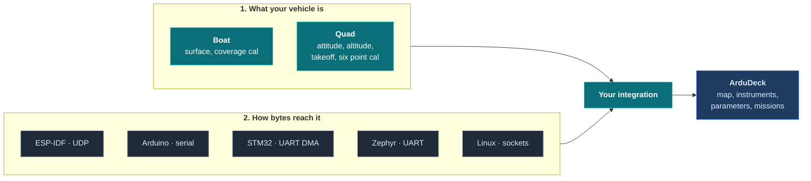
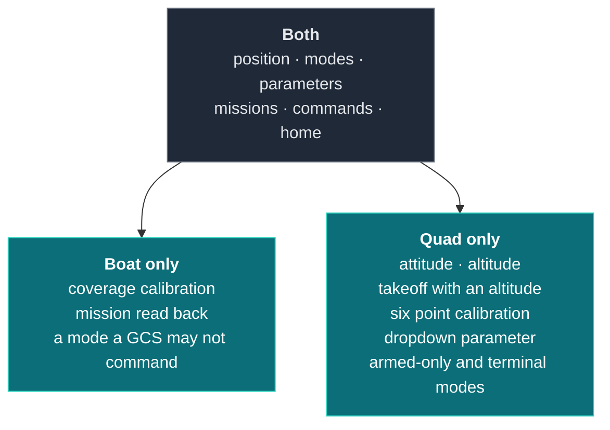

# Examples

Complete files, not fragments. Every one is compiled by `make -C test examples`, board
specific ones included, so nothing here is code that merely looks right.

## Pick one of each

Two things vary between integrations, and they are independent. What your vehicle **is**
has nothing to do with how bytes **reach** it, so the vehicle examples are board agnostic
and the board examples are vehicle agnostic.



---

## Vehicles

The two are deliberately different vehicles, not the same one twice. Between them they
use every part of the contract.



### [Boat](examples/boat/ardudeck_link.c)

A small ESP32 boat, with the parameter names and modes a working firmware really has.
Rungs 0 through 4 plus a coverage compass routine, in about sixty lines of declaration.

Read this one for **how a second control surface sits beside an interface you already
have**. The boat keeps its own WebSocket and JSON protocol for the phone that drives it;
ArduDeck is the laptop, and neither replaces the other.

| It shows | Where it matters |
|---|---|
| A coverage calibration | The operator turns the vehicle until three tracks fill |
| Missions through the existing validator | One set of rules about what a valid plan is, not two |
| `AD_MODE_LOCAL_ONLY` | A mode that exists but is not a ground station's to command |

### [Quad](examples/quad/ardudeck_link.c)

A multirotor, covering everything a surface vehicle has no use for.

| It shows | Where it matters |
|---|---|
| `ardudeck_attitude`, `ardudeck_altitude` | The horizon moves and height is a real number |
| `AD_CMD_TAKEOFF` | MAVLink puts the altitude in `param7`; the SDK hands it to you in `a[0]` |
| A **positional** calibration | Six named orientations, each held until accepted |
| `AD_ENUM` | The dropdown, with the getter and setter it needs |
| `AD_MODE_ARMED_ONLY`, `AD_MODE_TERMINAL` | Land is only offered in flight; a failsafe state is reached, never chosen |
| `ardudeck_silent_for` | The only thing that knows whether anybody is actually listening |

---

## Boards

The link layer is the only board specific part, and it is short. None of these knows
anything about your vehicle.

| Board | File | Lines | What it does |
|---|---|---|---|
| **ESP-IDF** | [`esp32_udp.c`](examples/transports/esp32_udp.c) | 75 | UDP on the access point the board already runs. Answers whoever spoke to it, so no address is ever typed in |
| **Arduino** | [`arduino_serial.ino`](examples/transports/arduino_serial.ino) | 65 | Hardware serial at 57600, what most telemetry radios default to. A complete rung 0 vehicle, end to end |
| **STM32 HAL** | [`stm32_uart.c`](examples/transports/stm32_uart.c) | 59 | UART with DMA receive into a ring, handed over in at most two pieces |
| **Zephyr** | [`zephyr_uart.c`](examples/transports/zephyr_uart.c) | 62 | Interrupt driven UART. Bytes land in a ring from the ISR, the SDK is fed from a thread |
| **Linux** | [`linux_udp.c`](examples/transports/linux_udp.c) | 73 | POSIX sockets, for a companion computer or your own desktop |

### No hardware yet? Start here

The Linux one builds and runs on the machine you are reading this on, so ArduDeck can be
talking to your vehicle logic before a board exists.

```sh
cc -o vehicle linux_udp.c your_vehicle.c ../../src/ad_*.c ../../src/ardudeck.c \
   -I../../include
./vehicle
```

Connect ArduDeck to UDP 14550. The same binary is what you point
[ardudeck-conform](conformance.md) at, so you can be passing the conformance table before
you have soldered anything.

---

## Not here yet

Rover, fixed wing, submarine and helicopter. A rover is close enough to the boat to copy
it and change the frame; the other three have shapes of their own, and they are coming.

If you build one, [ardudeck-conform](conformance.md) is what says whether it is right, and
that same table is what we would review it against.

---

[Getting started](getting-started.md) · [The contract](contract.md) · [API reference](api.md) · [Calibration](calibration.md) · [Links](transports.md) · [ardudeck-conform](conformance.md) · [When it is not working](troubleshooting.md)
