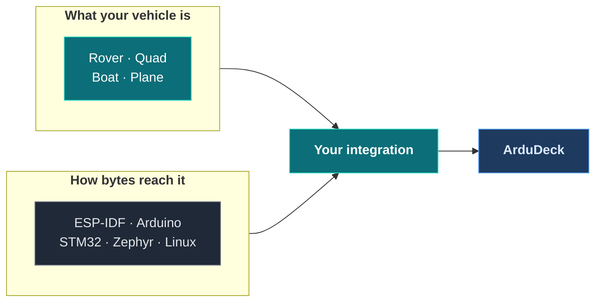

# Examples

Every snippet below is lifted from a file in this repository that compiles in CI. Copy
one, change the names, ship it.

| File | Lines | Use it for |
|---|---|---|
| [`examples/transports/arduino_serial.ino`](examples/transports/arduino_serial.ino) | 65 | The smallest thing that appears on a map |
| [`examples/rover/`](examples/rover) | 4 files | **A firmware you can run**, and the integration bolted on beside it |
| [`examples/boat/ardudeck_link.c`](examples/boat/ardudeck_link.c) | 208 | A surface vehicle, rungs 0 to 4, coverage calibration |
| [`examples/quad/`](examples/quad) | 4 files | **A multirotor you can fly**: takes off, flies a plan, comes home |
| [`examples/plane/ardudeck_link.c`](examples/plane/ardudeck_link.c) | 233 | A fixed wing: airspeed, circling loiter, instant and sweep calibrations |
| [`examples/transports/esp32_udp.c`](examples/transports/esp32_udp.c) | 75 | ESP-IDF, UDP on the board's own AP |
| [`examples/transports/stm32_uart.c`](examples/transports/stm32_uart.c) | 59 | STM32 HAL, UART with DMA receive |
| [`examples/transports/zephyr_uart.c`](examples/transports/zephyr_uart.c) | 62 | Zephyr, interrupt driven UART |
| [`examples/transports/linux_udp.c`](examples/transports/linux_udp.c) | 73 | Linux or a companion computer, and SITL |

---



The two are independent, so pick one of each.

---

## Hello, vehicle

Everything you need to be a dot on a map with a live horizon. This is the whole sketch,
not an excerpt.

```c src=examples/transports/arduino_serial.ino
static const ad_mode_t MODES[] = {
  {0, "Manual", 0},
};

static const ad_capability_t CAPS = {
  .vendor = "workshop",
  .model = "test rig",
  .firmware = "0.1.0",
  .frame = AD_FRAME_ROVER,
  .features = 0,            /* rung 0 only: a dot on the map and a horizon */
  .modes = MODES,
  .mode_count = 1,
};

static ad_config_t CONFIG = {
  .caps = &CAPS,
  .send = sink,
  .now_ms = now_ms,
};

void setup() {
  Serial1.begin(57600);
  ardudeck_begin(&CONFIG);
}

void loop() {
  while (Serial1.available()) {
    uint8_t byte = (uint8_t)Serial1.read();
    ardudeck_receive(&byte, 1);
  }

  ardudeck_position(lat, lon, speed_ms, heading_deg, fix, sats);
  ardudeck_status(mode, active_item, volts, armed);

  ardudeck_tick(now_ms());
  delay(20);
}
```

Full file: [`arduino_serial.ino`](examples/transports/arduino_serial.ino)

---

## A whole firmware, and the seam

Every snippet on this page shows the SDK half against `extern` stubs.
[`examples/rover`](examples/rover) is the other thing: a firmware that actually drives to
waypoints, with the integration beside it in its own file, so you can see exactly where
one ends and the other begins.

```
examples/rover/
  vehicle.h        what the firmware already offers
  vehicle.c        the firmware. Drives to waypoints. Never mentions ArduDeck
  ardudeck_link.c  the integration. Talks to it only through vehicle.h
  main.c           a loop and a UDP socket
```

```sh
git clone https://github.com/rubenCodeforges/ardudeck-vehicle-sdk
cd ardudeck-vehicle-sdk/examples/rover
make && ./rover                          # then connect ArduDeck to UDP 14550
```

It drives a mission you upload, refuses to arm on a flat battery in its own words, and
its steering gain is a parameter you can turn up and watch the turns tighten.

**[Build a rover](build-a-rover.md) walks through the whole thing**, from the firmware's
header to running the conformance table against it, in ten steps.

---

## Built on real hardware

Everything above is ours. These two are not. Both were written against these docs by
somebody who was not us, both run on an ESP32, and both pass the conformance table.

**`rover-fc`**, about 5,800 lines: a GPS waypoint rover with a compass, a steering servo
and a car ESC, which already had its own text command line before ArduDeck existed and
guards the shared state with one mutex. 43 parameters, missions that round-trip, a
coverage compass routine. [Build a rover](build-a-rover.md) covers it.

**`quadfc`**, about 6,400 lines of plain ESP-IDF with MPU6050 and BMP280
drivers, a Mahony AHRS, PID, mixer, CRSF / SBUS / PPM receivers, arming and failsafe, and
this SDK on top. It keeps a host SITL of its integration, so the conformance tool runs
against it with no board plugged in:

```
PASS  rung 0  position      heartbeat 1.0 Hz, position x40, attitude x49, GPS fix 3
PASS  rung 1  identity      quadfc ESP32 Quad X fw 0.1.0, 4 modes named, 0 mission commands
WARN  rung 2  parameters    72 parameters, 72 with metadata
SKIP  rung 3  missions      not declared
PASS  rung 4  commands      unknown command refused in 6 ms
PASS  extra   calibration   3 declared
PASS  extra   link          10 heartbeats, 80 telemetry in 10 s with nothing requested

6 of 6 tested, 0 failing.
```

Read it for the things a simulation cannot show: where the SDK sits in a real task layout,
beside a 1 kHz flight loop with a seqlock between them; seventy two parameters, enough
that the editor's search and ranges start earning their place; and three calibrations on
real sensors.

Note what it does **not** declare: missions. It is an acro and angle quad flown on sticks,
so ArduDeck hides mission planning for it rather than showing a plan it would ignore.
That is the contract working as intended, on somebody else's firmware.

[Build a quad](build-a-quad.md) covers it alongside the simulated one.

---

## Then what

| | |
|---|---|
| **[Build a rover](build-a-rover.md)** | A real ESP32 GPS rover: parts, wiring, flashing, then ArduDeck. With a desktop simulation if you have no hardware |
| **[Build a boat](build-a-boat.md)** | Adding ArduDeck beside an app your firmware already has, without the two fighting |
| **[Build a quad](build-a-quad.md)** | A real ESP32 multirotor: parts, wiring, flashing, then ArduDeck |
| **[Build a plane](build-a-plane.md)** | Airspeed that is not groundspeed, a loiter that is a circle, and the last two calibration shapes |
| **[Recipes](recipes.md)** | The declaration, parameters, missions, commands, calibration and the link failsafe, each as a block you can paste |
| **[Links](transports.md)** | Getting bytes in and out on your board |

---

## Run one without hardware

```sh
cd ardudeck-vehicle-sdk/examples/transports
cc -o vehicle linux_udp.c your_vehicle.c ../../src/ad_*.c ../../src/ardudeck.c \
   -I../../include
./vehicle
```

Connect ArduDeck to UDP 14550. The same binary is what you point the conformance tool at,
so you can pass the table before soldering anything:

```sh
make -C conformance                       # once, from the SDK root
./conformance/ardudeck-conform --udp 14550
```

---

## Not here yet

Submarine and helicopter. A sub swaps altitude for depth; a heli is close to the quad
apart from its own parameters.

---

[Getting started](getting-started.md) · [Build a rover](build-a-rover.md) · [The contract](contract.md) · [API reference](api.md) · [Calibration](calibration.md) · [Links](transports.md) · [ardudeck-conform](conformance.md) · [When it is not working](troubleshooting.md)
