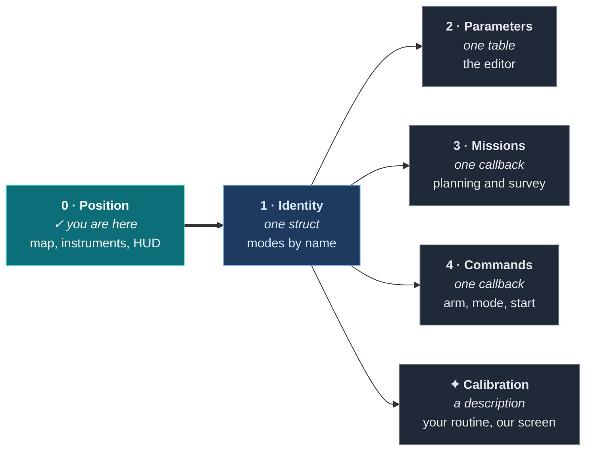

# Getting started

By the end of this page your vehicle is on ArduDeck's map with a live instrument panel.
Budget about twenty minutes. You do not need to read anything else first.

---

## What you are building


Teal is your code, grey is the SDK, blue is ArduDeck.

**You give the SDK numbers. It gives you bytes.** Where those bytes go is entirely your
choice, and the SDK never finds out. It never touches an actuator: everything inbound
arrives as a callback your own code can refuse.

---

## Step 1: add the library

Pick whichever matches your project.

| Your build | What to do |
|---|---|
| **ESP-IDF** | Copy the repo into `components/ardudeck/`, or add it to `idf_component.yml`. |
| **PlatformIO** | `lib_deps = https://github.com/rubenCodeforges/ardudeck-vehicle-sdk` |
| **Arduino** | Drop the folder into `libraries/`. |
| **CMake** | `add_subdirectory(ardudeck-vehicle-sdk)` then link `ardudeck::sdk`. |
| **Makefile, anything else** | Compile `src/*.c` and put `include/` on your include path. That is the whole integration. |

It is C99 and needs no configuration to build. If it does not compile, that is a bug in
the SDK and worth reporting, not something for you to work around.

---

## Step 2: the smallest thing that works

Create one file. This is the complete text, not an excerpt.

```c
#include "ardudeck.h"

/* 1. What this vehicle is. */
static const ad_capability_t CAPS = {
  .vendor   = "acme",
  .model    = "quad v2",
  .firmware = "1.4.0",
  .frame    = AD_FRAME_MULTIROTOR,
  .features = 0,                  /* telemetry only for now */
};

/* 2. Where the bytes go. Replace link_write with whatever you have. */
static void sink(const uint8_t *buf, size_t len, void *user) {
  (void)user;
  link_write(buf, len);
}

/* 3. Start it once. */
void my_setup(void) {
  static const ad_config_t cfg = {
    .caps   = &CAPS,
    .send   = sink,
    .now_ms = millis,             /* your millisecond clock */
  };
  ardudeck_begin(&cfg);
}

/* 4. Feed it, from a loop you already have. Anything above 20 Hz is plenty. */
void my_loop(void) {
  ardudeck_position(lat, lon, speed_ms, heading_deg, fix, sats);
  ardudeck_attitude(roll_rad, pitch_rad, yaw_rad);
  ardudeck_status(mode_id, 0, battery_volts, armed);
  ardudeck_tick(millis());
}
```

And wherever bytes arrive from the ground station:

```c
ardudeck_receive(buf, len);
```

That is it. Four calls and a struct.

> **Your clock may wrap and that is fine.** `now_ms` is expected to be a plain
> millisecond counter. It rolls over every 49 days and the SDK handles it. Do not reset
> it, and do not try to be clever.

---

## Step 3: get the bytes onto a wire

### Over USB, which is the easiest way to start

Write the SDK's bytes to your serial port, and feed anything that arrives back in.

```c
static void sink(const uint8_t *buf, size_t len, void *user) {
  (void)user;
  uart_write_bytes(UART_NUM_0, buf, len);
}
```

> ### ⚠ The one that catches everyone
>
> **On most boards, UART0 is also where your logs go.** Your MAVLink frames and your
> `printf` output end up interleaved on the same wire. ArduDeck will recover, because the
> parser resynchronises, but you will lose frames and spend an hour blaming the SDK.
>
> Either turn the console off on that port, or put MAVLink on a different UART. On
> ESP-IDF that is `Component config → ESP System Settings → Channel for console output`.

### Over WiFi, once USB works

Broadcast UDP to port 14550. Nothing needs configuring at either end, because ArduDeck
listens and answers whoever it hears.

See [transports.md](transports.md) for radio modems, rate limits and the rest.

---

## Step 4: look at it

Open ArduDeck, connect to the serial port or UDP 14550, and you should see your vehicle
on the map with a moving instrument panel.

**If nothing appears**, do not guess. Run the conformance tool, which will tell you what
is wrong in one line:

```
make -C conformance
./conformance/ardudeck-conform --serial /dev/ttyUSB0:57600
```

See [troubleshooting.md](troubleshooting.md) if you would rather read symptoms.

---

## Step 5: climb, or stop

You are now on rung 0. Everything above it is optional, independent, and can be done in
any order or not at all.



Everything after rung 1 is **independent**. Take parameters without missions, or commands
without either, in whatever order suits you.

**Rung 1 is the one that matters**, and it is the shortest. Until you declare what your
vehicle is, ArduDeck assumes ArduPilot: your mode picker shows modes you do not have, and
pressing one sends a number that means something else on your firmware.

### Rung 1, in full

```c
static const ad_mode_t MODES[] = {
  /*  id, name shown to the pilot, flags */
  {  0, "Idle",      0 },
  {  1, "Running",   0 },
  {  4, "Returning", 0 },
  {  6, "Manual",    AD_MODE_LOCAL_ONLY },   /* exists, but not ours to command */
};

static const uint16_t MISSION_CMDS[] = { AD_NAV_WAYPOINT, AD_NAV_RETURN_TO_LAUNCH };

static const ad_capability_t CAPS = {
  .vendor = "acme", .model = "quad v2", .firmware = "1.4.0",
  .frame  = AD_FRAME_MULTIROTOR,
  .features = AD_FEAT_PARAMS | AD_FEAT_MISSION | AD_FEAT_COMMANDS,

  .modes = MODES, .mode_count = 4,
  .mission_cmds = MISSION_CMDS, .mission_cmd_count = 2,
  .mission_capacity = 64,
};
```

> ### The rule the whole thing runs on
>
> **A capability you do not declare is a screen ArduDeck hides.**
>
> Declare less than you support and you lose a screen until you add it. Declare more and
> your operator gets a mission planner that uploads plans your vehicle refuses, and a
> button that does nothing.
>
> **Under-declare, then grow.** It is always the safer direction.

---

## Where to go next

| You want to | Read |
|---|---|
| Add parameters, missions or commands | [contract.md](contract.md) |
| Look up a function or struct field | [api.md](api.md) |
| Put your compass routine on ArduDeck's screen | [calibration.md](calibration.md) |
| Find out why something is not working | [troubleshooting.md](troubleshooting.md) |
| Choose or configure a link | [transports.md](transports.md) |
| Prove it before you ship | [conformance.md](conformance.md) |

---

**Getting started** · [Contract](contract.md) · [API](api.md) · [Calibration](calibration.md) · [Links](transports.md) · [Conformance](conformance.md) · [Troubleshooting](troubleshooting.md)
