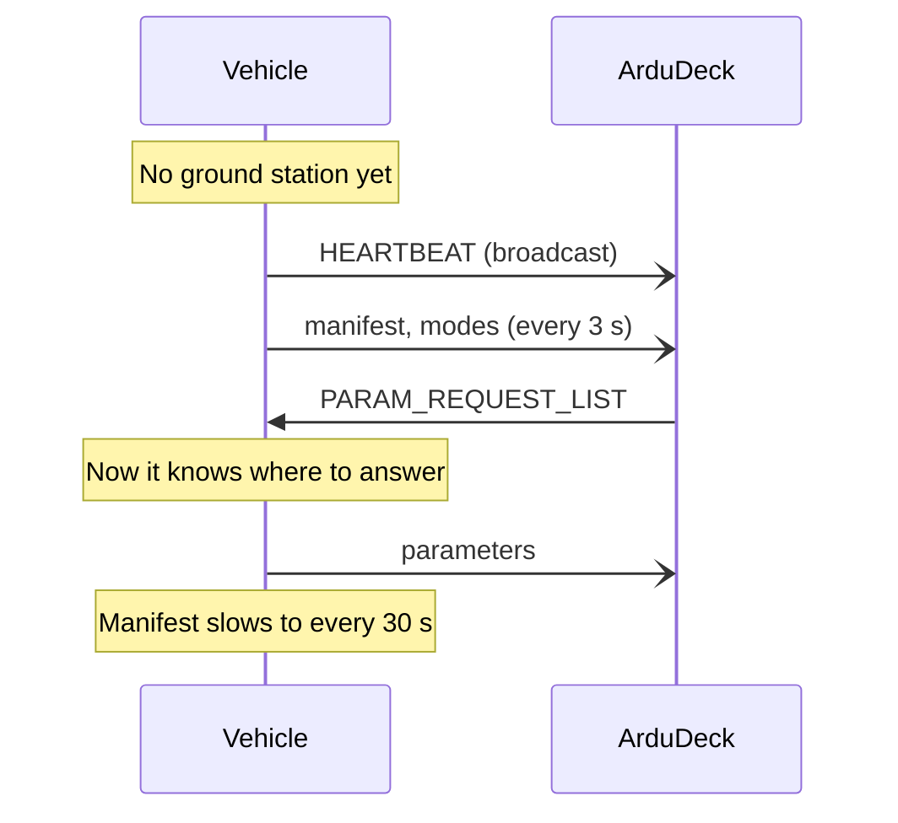

# Links

The SDK produces complete frames and hands them to you. It has no idea what happens next,
which means anything that moves bytes will do.

**Working files for five boards**, each of them compiled in CI rather than written out
from memory:

| Board | File | Link |
|---|---|---|
| ESP-IDF | [`esp32_udp.c`](examples/transports/esp32_udp.c) | UDP on the board's own AP |
| Arduino | [`arduino_serial.ino`](examples/transports/arduino_serial.ino) | Hardware serial |
| STM32 HAL | [`stm32_uart.c`](examples/transports/stm32_uart.c) | UART, DMA receive |
| Zephyr | [`zephyr_uart.c`](examples/transports/zephyr_uart.c) | Interrupt driven UART |
| Linux | [`linux_udp.c`](examples/transports/linux_udp.c) | POSIX socket, and SITL |

If none of those is your board, the rest of this page is what they all have in common.

```c
static void sink(const uint8_t *buf, size_t len, void *user) {
  (void)user;
  /* whatever you have */
}
```

Inbound, from wherever bytes arrive:

```c
ardudeck_receive(buf, len);
```

`ardudeck_receive` accepts any size and any split, **including one byte at a time**. You
never need to reassemble frames yourself.

---

## Choosing one

| Link | Good for | Watch out for |
|---|---|---|
| **USB serial** | Bench work, first light, flashing and testing in one cable | The console usually shares it. See below. |
| **UDP broadcast** | WiFi, field use, nothing to configure at either end | Everything on the subnet hears it |
| **UDP unicast** | Busy field networks | Somebody has to type an address |
| **Radio modem** | Long range | Set a rate cap or it saturates |
| **ELRS backpack** | You already have one | Backpack bandwidth. Position and status, not 50 Hz attitude |

---

## USB serial

The fastest way to see something working.

```c
static void sink(const uint8_t *buf, size_t len, void *user) {
  (void)user;
  uart_write_bytes(UART_NUM_0, (const char *)buf, len);
}
```

> ### ⚠ The console is probably on that port
>
> On most boards UART0 carries both your MAVLink and your log output. The result is not a
> clean failure: the parser resynchronises on the next frame marker, so you lose some
> frames and keep others, and it looks like a flaky cable.
>
> ```
> what you send:     [FD ...frame...][FD ...frame...][FD ...frame...]
> what actually      [FD ...frame...]I (4521) wifi: connected[FD ...fra
> goes out:          me...][FD ...frame...]
>                                     ^^^^^^^^^^^^^^^^^^^^^^
>                                     this frame is lost
> ```
>
> **Fix it before you debug anything else.** Either disable the console on that UART, or
> put MAVLink on another one.
>
> On ESP-IDF: `Component config → ESP System Settings → Channel for console output`.

Baud does not matter to the SDK. 57600 and 115200 are both common; match whatever you set
in ArduDeck.

---

## UDP broadcast

Nothing to configure on either end. **Send to port 14550**, broadcast, and ArduDeck
answers whoever it hears.

You do not need to listen on a fixed port. A ground station replies to the address and
port your packets came *from*, so one socket used for both directions is all it takes.
Bind it to whatever the operating system gives you and leave it alone.



The vehicle repeats its manifest every few seconds until something answers, then drops to
a slow keepalive. That is what makes a ground station that starts late still work.

---

## Radio modems and anything slow

Cap the streams your link cannot carry:

```c
ardudeck_rate_limit(AD_STREAM_ATTITUDE, 2.0f);
ardudeck_rate_limit(AD_STREAM_POSITION, 1.0f);
ardudeck_rate_limit(AD_STREAM_RC, 0.0f);       /* off entirely */
```

Default rates, before any cap:

| Stream | Default | What it feeds |
|---|---|---|
| heartbeat | 1 Hz, fixed | The vehicle existing at all |
| position | 4 Hz | Map, track, GPS readouts |
| attitude | 10 Hz | Horizon, synthetic vision |
| status, battery | 1 Hz | Battery, mission progress, home |
| rc | off | Receiver channels, if you report them |

A 900 MHz modem at 19200 baud cannot serve 10 Hz attitude. An honest refusal is better
than a saturated link, because the first thing a saturated link drops is the heartbeat,
and a missing heartbeat reads to the operator as a dead aircraft.

---

## Two links at once

Perfectly fine, and often the right answer. The boat in `examples/` keeps its own
WebSocket for the phone on the dock and adds MAVLink for a laptop, because a browser
cannot open a UDP socket and never will.

Call `sink` for both, and feed both into `ardudeck_receive`. The SDK has no notion of
which link something arrived on and does not need one.

---

## What the SDK does not do

**It never retransmits telemetry.** A dropped position frame is replaced a quarter of a
second later by a newer one, which is better than the old one. Only the parameter,
mission and command handshakes retry, and they handle it themselves.

**It never splits a frame.** Every call to your `send` is one complete frame, at most 280
bytes. If your transport has a smaller MTU, that is yours to handle.

**It never blocks.** If your `send` blocks, the SDK blocks, inside whatever loop called
`ardudeck_tick`.

---

[Getting started](getting-started.md) · [Contract](contract.md) · [API](api.md) · [Calibration](calibration.md) · **Links** · [Conformance](conformance.md) · [Troubleshooting](troubleshooting.md)
