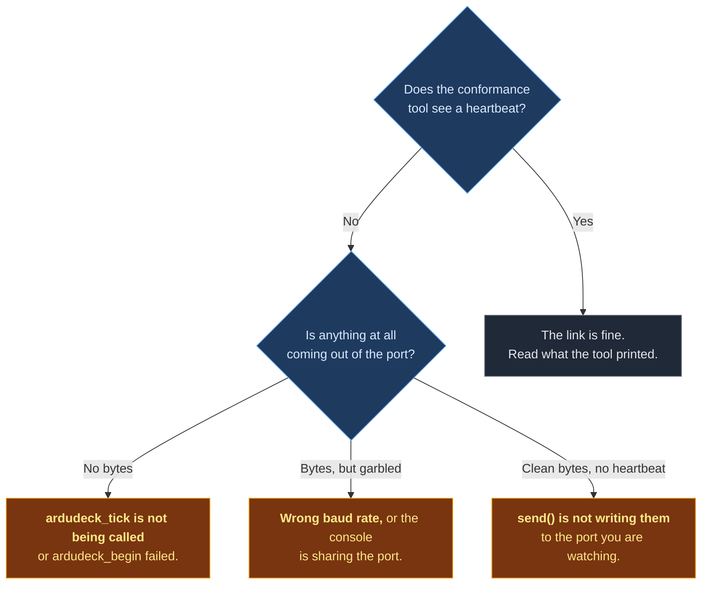

# When it is not working

Find your symptom. Each one has a cause, not a list of things to try.

---


## The vehicle is on the map but has no parameters or calibrations

Check the ArduDeck version first: the profile needs **0.1.2 or newer**.

Rung 0 is ordinary MAVLink, so an older build shows the vehicle and moves the instruments.
Everything above it rides in the profile, which earlier versions do not read, so those
screens are absent rather than broken and nothing is logged either side.

If the version is right, run the conformance tool: a manifest that never arrives, or a
feature bit you did not declare, produces exactly the same symptom.

## Nothing appears in ArduDeck at all



**`ardudeck_begin` silently does nothing** if `send` or `now_ms` is NULL. It has no way
to report that, because it has no way to talk to you yet. Check both are set.

**Your loop may not be running.** `ardudeck_tick()` is what actually sends. Feeding state
with `ardudeck_position()` and never ticking produces total silence.

---

## Frames are corrupted, or ArduDeck sees some and not others

**The console is on the same UART.** This is the most common cause by a distance. Your
log text lands between MAVLink frames. The parser resynchronises so it looks
intermittent, not broken, which is what makes it hard to spot.

Turn off console output on that port, or move MAVLink to another UART.

**A quick way to tell:** open the port in a terminal. If you can read English words, your
logs are on it.

---

## The vehicle appears but the mode is wrong, or a mode button does nothing

**You have not declared your modes.** Without them ArduDeck falls back to ArduPilot's
table for your frame type, so a boat is offered ArduPilot's rover modes. The names are
wrong and, worse, pressing one sends a number that means something different on your
firmware.

Fix: fill in `.modes` and `.mode_count`. It is four lines.

---

## A mode I do not want commanded appears in the picker

Flag it:

```c
{ 6, "Manual", AD_MODE_LOCAL_ONLY },
```

ArduDeck will show it as the current mode when you are in it, and will not offer it as
something to switch into.

---

## Parameters show as a bare list with no units or explanation

**You sent values but not metadata.** `PARAM_VALUE` carries the number; the description,
unit and range come from `ARDUDECK_PARAM_META`, which the SDK sends for you from your
parameter table.

If you built the table with the `AD_F32` and `AD_I32` macros this happens automatically.
If parameters appear with no help text, check you passed a real description string rather
than `""`.

---

## A parameter write appears to work and then reverts

The editor shows whatever value the vehicle reports **after** the write. If you clamp,
round or refuse a value, the editor is showing you the truth.

If it reverts to the old value entirely, your `on_param_set` returned `false`, or your
storage pointer is not where the value actually lives.

---

## I calibrated, and the parameter screen still shows the old offsets

**Your routine changed values and did not say so.** The editor has no way to know.

```c
ardudeck_cal_done("compass", true, 0.91f, "Offsets stored");
ardudeck_param_changed("MAG_OFS_X");   /* for every value you wrote */
ardudeck_param_changed("MAG_OFS_Y");
ardudeck_param_changed("MAG_OFS_Z");
```

Without those calls, the operator's next save writes the stale numbers straight back over
the calibration they just did.

---

## A mission upload is refused

Read the message. The refusal carries **your own sentence**, because you wrote it in
`on_mission`'s `why` buffer. If it says something unhelpful, that is your string.

If it is refused with no message at all, it was refused by the SDK before reaching you,
which happens for exactly three reasons:

| Refusal | Why |
|---|---|
| `UNSUPPORTED` | The plan contains a command not in your `mission_cmds` list |
| `NO_SPACE` | More items than your `mission_capacity` |
| `UNSUPPORTED_FRAME` | A terrain-relative altitude, and you did not declare `AD_FEAT_TERRAIN` |

---

## A mission upload starts and then stalls

The transfer times out after four seconds of silence and gives up cleanly. If it happens
every time, your `send` is probably blocking or dropping under load: the SDK sends a
request for the next item and never gets to write it.

---

## A command does nothing and the operator presses it again

**You returned nothing.** Every command must be answered, including the ones you do not
implement. The SDK does that for you if `on_command` returns `false`, but only if
`AD_FEAT_COMMANDS` is declared and the callback is wired.

**Acknowledge before you act.** A command that reboots or blocks for 400 ms looks
identical to one that was ignored.

```c
case AD_CMD_SET_MODE:
  request_mode_change((int)args[0]);   /* not a blocking switch */
  return true;
```

---

## My link failsafe fires while a mission is running from a ground station

You are timing the wrong link. `ardudeck_silent_for(now)` is how long since anything was
heard from a ground station, and that is what a MAVLink-side failsafe should watch. If
your vehicle also has another link with its own failsafe, that one is still counting.

## The vehicle shows up with the wrong icon

Set `.frame` in the capability struct. The heartbeat carries a MAV_TYPE derived from it,
and `AD_FRAME_UNKNOWN` sends a generic one that every ground station draws as a nondescript
aircraft.

## Everything works over USB and nothing works over the radio

Your link cannot carry the default rates. Cap them:

```c
ardudeck_rate_limit(AD_STREAM_ATTITUDE, 2.0f);   /* instead of 10 Hz */
ardudeck_rate_limit(AD_STREAM_POSITION, 1.0f);
```

A saturated link drops heartbeats, and a dropped heartbeat looks to the operator like the
vehicle died.

---

## The conformance tool fails a rung and I disagree

It prints the field it is unhappy about. Three that surprise people:

**"declares feature bits ... which this profile version defines no protocol for."**
You set `AD_FEAT_GEOFENCE`, `AD_FEAT_MANUAL_CONTROL` or `AD_FEAT_LOG_DOWNLOAD`. Those bit
numbers are reserved for future use and there is nothing behind them yet. Clear them.

**"reported latitude 0, longitude 0."** That is a real place in the Gulf of Guinea. If
you have no fix, report `fix = 0` and the SDK withholds the position entirely. Absent is
not zero.

**"3 parameters have no description."** Every parameter needs one line saying what
changing it does. Units are optional, because a pure gain genuinely has none.

---

## Still stuck

Run the conformance tool with `--json` and open an issue with that output attached. It
contains the manifest, the rung results and the failing fields, which is everything
needed to reproduce your situation without your hardware.

---

[Getting started](getting-started.md) · [Contract](contract.md) · [API](api.md) · [Calibration](calibration.md) · [Links](transports.md) · [Conformance](conformance.md) · **Troubleshooting**
